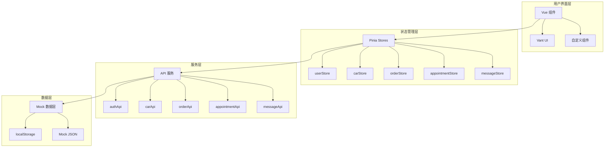

# 车故二手车交易平台 MVP 设计文档

## 概述

本设计文档描述车故二手车交易平台 MVP 版本的技术架构、组件设计和实现方案。该平台是一个面向 C 端用户的移动优先 Web 应用，使用 Vue 3 + TypeScript 技术栈，通过 Mock 数据模拟后端服务，旨在向投资人展示完整的产品体验。

### 技术栈选型

| 类别 | 技术选型 | 说明 |
|------|----------|------|
| 前端框架 | Vue 3.4+ | 使用 Composition API，支持 TypeScript |
| 类型系统 | TypeScript 5.0+ | 确保类型安全和代码质量 |
| 状态管理 | Pinia 2.1+ | Vue 3 官方推荐，简洁高效 |
| 路由 | Vue Router 4.2+ | 支持路由守卫和懒加载 |
| UI 组件库 | Vant 4.8+ | 移动端优先，组件丰富 |
| 构建工具 | Vite 5.0+ | 快速开发和构建 |
| HTTP 客户端 | Axios 1.6+ | 请求拦截和响应处理 |
| 日期处理 | Day.js 1.11+ | 轻量级日期库 |
| 图片处理 | Compressor.js | 客户端图片压缩 |

## 架构

### 整体架构图



### 目录结构

```
src/
├── api/                    # API 接口层
│   ├── auth.ts            # 认证相关接口
│   ├── car.ts             # 车源相关接口
│   ├── order.ts           # 订单相关接口
│   ├── appointment.ts     # 预约相关接口
│   ├── message.ts         # 消息相关接口
│   └── index.ts           # 统一导出
├── assets/                 # 静态资源
│   ├── images/            # 图片资源
│   └── styles/            # 全局样式
├── components/             # 公共组件
│   ├── CarCard.vue        # 车源卡片
│   ├── SearchBar.vue      # 搜索栏
│   ├── FilterPanel.vue    # 筛选面板
│   ├── ImageUploader.vue  # 图片上传
│   └── EmptyState.vue     # 空状态
├── composables/            # 组合式函数
│   ├── useAuth.ts         # 认证逻辑
│   ├── useFavorite.ts     # 收藏逻辑
│   ├── useFilter.ts       # 筛选逻辑
│   └── useInfiniteScroll.ts # 无限滚动
├── layouts/                # 布局组件
│   ├── DefaultLayout.vue  # 默认布局（带底部导航）
│   └── SimpleLayout.vue   # 简单布局（无底部导航）
├── mock/                   # Mock 数据
│   ├── cars.json          # 车源数据
│   ├── users.json         # 用户数据
│   ├── brands.json        # 品牌数据
│   ├── cities.json        # 城市数据
│   └── index.ts           # Mock 服务初始化
├── router/                 # 路由配置
│   ├── index.ts           # 路由实例
│   └── guards.ts          # 路由守卫
├── stores/                 # Pinia 状态管理
│   ├── user.ts            # 用户状态
│   ├── car.ts             # 车源状态
│   ├── order.ts           # 订单状态
│   ├── appointment.ts     # 预约状态
│   └── message.ts         # 消息状态
├── types/                  # TypeScript 类型定义
│   ├── user.ts            # 用户类型
│   ├── car.ts             # 车源类型
│   ├── order.ts           # 订单类型
│   ├── appointment.ts     # 预约类型
│   ├── message.ts         # 消息类型
│   └── common.ts          # 通用类型
├── utils/                  # 工具函数
│   ├── storage.ts         # 本地存储
│   ├── format.ts          # 格式化
│   ├── validate.ts        # 验证
│   └── image.ts           # 图片处理
├── views/                  # 页面组件
│   ├── home/              # 首页
│   ├── car/               # 车源相关页面
│   ├── order/             # 订单相关页面
│   ├── user/              # 用户相关页面
│   ├── seller/            # 卖家相关页面
│   └── auth/              # 认证相关页面
├── App.vue                 # 根组件
└── main.ts                 # 入口文件
```

## 组件与接口

### 核心组件设计

#### 1. CarCard 组件

```typescript
// components/CarCard.vue
interface CarCardProps {
  car: CarListItem
  showFavorite?: boolean
  showStatus?: boolean
}

interface CarCardEmits {
  (e: 'click', car: CarListItem): void
  (e: 'favorite', car: CarListItem): void
}
```

#### 2. SearchBar 组件

```typescript
// components/SearchBar.vue
interface SearchBarProps {
  placeholder?: string
  modelValue?: string
  showHistory?: boolean
}

interface SearchBarEmits {
  (e: 'update:modelValue', value: string): void
  (e: 'search', keyword: string): void
  (e: 'clear'): void
}
```

#### 3. FilterPanel 组件

```typescript
// components/FilterPanel.vue
interface FilterPanelProps {
  filters: CarFilters
  brands: Brand[]
  cities: City[]
}

interface FilterPanelEmits {
  (e: 'update:filters', filters: CarFilters): void
  (e: 'reset'): void
  (e: 'confirm'): void
}
```

### API 接口设计

#### 认证模块 API

```typescript
// api/auth.ts
interface AuthApi {
  // 发送验证码
  sendSmsCode(mobile: string, scene: SmsScene): Promise<ApiResponse<null>>
  
  // 短信登录
  loginBySms(mobile: string, code: string): Promise<ApiResponse<LoginResult>>
  
  // 获取用户信息
  getUserProfile(): Promise<ApiResponse<User>>
  
  // 更新用户信息
  updateUserProfile(data: UpdateProfileData): Promise<ApiResponse<User>>
  
  // 退出登录
  logout(): Promise<ApiResponse<null>>
}
```

#### 车源模块 API

```typescript
// api/car.ts
interface CarApi {
  // 获取首页数据
  getHomeData(): Promise<ApiResponse<HomeData>>
  
  // 获取车源列表
  getCarList(params: CarListParams): Promise<ApiResponse<PageResult<CarListItem>>>
  
  // 获取车源详情
  getCarDetail(id: number): Promise<ApiResponse<CarDetail>>
  
  // 收藏车源
  favoriteCar(id: number): Promise<ApiResponse<null>>
  
  // 取消收藏
  unfavoriteCar(id: number): Promise<ApiResponse<null>>
  
  // 获取收藏列表
  getFavorites(params: PageParams): Promise<ApiResponse<PageResult<CarListItem>>>
  
  // 获取浏览历史
  getHistories(params: PageParams): Promise<ApiResponse<PageResult<CarListItem>>>
  
  // 发布车源（卖家）
  publishCar(data: PublishCarData): Promise<ApiResponse<Car>>
  
  // 更新车源（卖家）
  updateCar(id: number, data: UpdateCarData): Promise<ApiResponse<Car>>
  
  // 更新车源状态（卖家）
  updateCarStatus(id: number, status: CarStatus): Promise<ApiResponse<null>>
  
  // 获取卖家车源列表
  getSellerCars(params: SellerCarListParams): Promise<ApiResponse<PageResult<Car>>>
}
```

#### 订单模块 API

```typescript
// api/order.ts
interface OrderApi {
  // 创建订单
  createOrder(data: CreateOrderData): Promise<ApiResponse<Order>>
  
  // 获取订单详情
  getOrderDetail(id: number): Promise<ApiResponse<OrderDetail>>
  
  // 获取订单列表
  getOrders(params: OrderListParams): Promise<ApiResponse<PageResult<Order>>>
  
  // 支付订单
  payOrder(id: number, channel: PayChannel): Promise<ApiResponse<PayResult>>
  
  // 取消订单
  cancelOrder(id: number): Promise<ApiResponse<null>>
}
```

#### 预约模块 API

```typescript
// api/appointment.ts
interface AppointmentApi {
  // 创建预约
  createAppointment(data: CreateAppointmentData): Promise<ApiResponse<Appointment>>
  
  // 获取买家预约列表
  getBuyerAppointments(params: PageParams): Promise<ApiResponse<PageResult<Appointment>>>
  
  // 获取卖家预约列表
  getSellerAppointments(params: SellerAppointmentParams): Promise<ApiResponse<PageResult<Appointment>>>
  
  // 处理预约（卖家）
  handleAppointment(id: number, action: AppointmentAction, data?: HandleAppointmentData): Promise<ApiResponse<null>>
}
```

## 数据模型

### 用户模型

```typescript
// types/user.ts
interface User {
  id: number
  mobile: string
  nickname: string
  avatar: string
  realName?: string
  idCard?: string
  authStatus: AuthStatus
  roleType: RoleType
  status: UserStatus
  createdAt: string
  updatedAt: string
}

type AuthStatus = 'unverified' | 'pending' | 'verified' | 'rejected'
type RoleType = 'buyer' | 'seller' | 'dealer'
type UserStatus = 'enabled' | 'disabled'

interface LoginResult {
  token: string
  user: User
}
```

### 车源模型

```typescript
// types/car.ts
interface Car {
  id: number
  title: string
  ownerId: number
  sourceType: SourceType
  brandId: number
  brandName: string
  seriesId: number
  seriesName: string
  modelId: number
  modelName: string
  firstRegDate: string
  mileage: number
  displacement: number
  gearbox: GearboxType
  emissionStandard: EmissionStandard
  useType: UseType
  transferCount: number
  cityCode: string
  cityName: string
  address: string
  price: number
  originalPrice?: number
  status: CarStatus
  coverImage: string
  images: string[]
  video?: string
  highlightDesc: string
  inspectionReport?: string
  createdAt: string
  updatedAt: string
}

type SourceType = 'personal' | 'dealer'
type GearboxType = 'MT' | 'AT' | 'DCT' | 'CVT'
type EmissionStandard = '国三' | '国四' | '国五' | '国六'
type UseType = 'family' | 'business' | 'official'
type CarStatus = 'draft' | 'pending' | 'approved' | 'on' | 'off' | 'sold'

interface CarListItem {
  id: number
  title: string
  coverImage: string
  price: number
  mileage: number
  firstRegDate: string
  cityName: string
  sourceType: SourceType
  isFavorited?: boolean
  status?: CarStatus
}

interface CarFilters {
  keyword?: string
  brandId?: number
  seriesId?: number
  minPrice?: number
  maxPrice?: number
  minAge?: number
  maxAge?: number
  minMileage?: number
  maxMileage?: number
  gearbox?: GearboxType
  cityCode?: string
  sourceType?: SourceType
  sort?: SortType
}

type SortType = 'default' | 'price_asc' | 'price_desc' | 'time_desc' | 'mileage_asc'
```

### 订单模型

```typescript
// types/order.ts
interface Order {
  id: number
  orderNo: string
  carId: number
  car: CarListItem
  buyerId: number
  sellerId: number
  amount: number
  totalPrice: number
  payChannel?: PayChannel
  status: OrderStatus
  createdAt: string
  payTime?: string
  cancelTime?: string
}

type OrderStatus = 'pending' | 'paid' | 'cancelled' | 'closed' | 'refunded'
type PayChannel = 'wechat' | 'alipay'

interface CreateOrderData {
  carId: number
  amount: number
}

interface PayResult {
  payParams: Record<string, string>
}
```

### 预约模型

```typescript
// types/appointment.ts
interface Appointment {
  id: number
  carId: number
  car: CarListItem
  buyerId: number
  buyer?: User
  sellerId: number
  seller?: User
  bookDate: string
  timeSlot: string
  status: AppointmentStatus
  remark?: string
  rejectReason?: string
  createdAt: string
  updatedAt: string
}

type AppointmentStatus = 'pending' | 'confirmed' | 'completed' | 'cancelled' | 'rejected'
type AppointmentAction = 'confirm' | 'reject' | 'complete' | 'update_time'

interface CreateAppointmentData {
  carId: number
  bookDate: string
  timeSlot: string
  remark?: string
}
```

### 消息模型

```typescript
// types/message.ts
interface Message {
  id: number
  userId: number
  type: MessageType
  title: string
  content: string
  link?: string
  isRead: boolean
  createdAt: string
}

type MessageType = 'system' | 'order' | 'appointment' | 'audit'
```

## 正确性属性

*A property is a characteristic or behavior that should hold true across all valid executions of a system-essentially, a formal statement about what the system should do. Properties serve as the bridge between human-readable specifications and machine-verifiable correctness guarantees.*

基于需求分析，以下是系统需要满足的核心正确性属性：

### Property 1: 认证状态一致性
*For any* 用户会话，如果 localStorage 中存在有效的 token，则 userStore 中的 isLoggedIn 状态应为 true，且 user 对象应包含有效的用户信息。
**Validates: Requirements 1.1, 1.2, 14.1, 14.2**

### Property 2: 筛选结果正确性
*For any* 筛选条件组合和车源列表，返回的每一个车源都应满足所有选中的筛选条件（价格区间、车龄、里程、变速箱类型、城市）。
**Validates: Requirements 3.2**

### Property 3: 排序结果正确性
*For any* 排序方式和车源列表，返回的车源列表应按指定规则正确排序（价格升序时，后一项价格 >= 前一项价格）。
**Validates: Requirements 3.3**

### Property 4: 搜索结果匹配性
*For any* 搜索关键词和车源列表，返回的每一个车源的标题或品牌名称应包含该关键词（不区分大小写）。
**Validates: Requirements 3.1**

### Property 5: 收藏操作一致性
*For any* 车源和用户，执行收藏操作后，该车源应出现在用户的收藏列表中；执行取消收藏操作后，该车源应从收藏列表中移除。
**Validates: Requirements 5.1, 5.2**

### Property 6: 浏览历史时序性
*For any* 浏览历史列表，记录应按访问时间倒序排列（最近访问的在前）。
**Validates: Requirements 5.5**

### Property 7: 预约状态转换合法性
*For any* 预约记录，状态转换必须遵循预定义的状态机：pending → confirmed/rejected/cancelled，confirmed → completed/cancelled。
**Validates: Requirements 6.2, 6.4, 9.2, 9.3, 9.5**

### Property 8: 订单状态转换合法性
*For any* 订单记录，状态转换必须遵循预定义的状态机：pending → paid/cancelled/closed，paid → refunded。
**Validates: Requirements 10.4, 11.5**

### Property 9: 订单号唯一性
*For any* 两个不同的订单，它们的订单号应不相同。
**Validates: Requirements 10.2**

### Property 10: 表单验证完整性
*For any* 车源发布表单，如果必填字段（品牌、车系、车型、上牌时间、里程、价格、图片）有任一为空，则表单验证应失败。
**Validates: Requirements 7.4**

### Property 11: 图片上传约束
*For any* 上传的图片，压缩后的大小应小于 500KB。
**Validates: Requirements 15.3**

### Property 12: 消息已读状态一致性
*For any* 消息，执行标记已读操作后，该消息的 isRead 属性应为 true；执行全部已读操作后，所有消息的 isRead 属性应为 true。
**Validates: Requirements 12.3, 12.5**

### Property 13: 未读消息计数正确性
*For any* 消息列表，未读消息数量应等于 isRead 为 false 的消息数量。
**Validates: Requirements 12.2**

### Property 14: 卖家车源归属性
*For any* 卖家车源列表查询，返回的每一个车源的 ownerId 应等于当前登录用户的 id。
**Validates: Requirements 8.1**

### Property 15: 路由守卫正确性
*For any* 需要认证的路由，如果用户未登录，则应重定向到登录页面。
**Validates: Requirements 1.3**

## 错误处理

### 错误类型定义

```typescript
// types/common.ts
interface ApiResponse<T> {
  code: number
  message: string
  data: T
}

interface ApiError {
  code: number
  message: string
}

// 业务错误码
const ErrorCodes = {
  SUCCESS: 0,
  PARAM_ERROR: 1001,
  UNAUTHORIZED: 1002,
  FORBIDDEN: 1003,
  TOO_MANY_REQUESTS: 1004,
  NOT_FOUND: 1005,
  OPERATION_FAILED: 1006,
  
  // 用户相关
  MOBILE_REGISTERED: 1101,
  SMS_CODE_ERROR: 1102,
  LOGIN_FAILED: 1103,
  ACCOUNT_DISABLED: 1104,
  
  // 车源相关
  CAR_NOT_FOUND: 2001,
  CAR_STATUS_ERROR: 2002,
  CAR_PERMISSION_DENIED: 2003,
  
  // 订单相关
  ORDER_NOT_FOUND: 3001,
  ORDER_STATUS_ERROR: 3002,
  PAY_FAILED: 3003,
}
```

### 全局错误处理

```typescript
// utils/request.ts
import axios from 'axios'
import { showToast } from 'vant'
import { useUserStore } from '@/stores/user'
import router from '@/router'

const request = axios.create({
  baseURL: '/api/v1',
  timeout: 10000,
})

// 请求拦截器
request.interceptors.request.use((config) => {
  const userStore = useUserStore()
  if (userStore.token) {
    config.headers.Authorization = `Bearer ${userStore.token}`
  }
  return config
})

// 响应拦截器
request.interceptors.response.use(
  (response) => {
    const { code, message, data } = response.data
    if (code === 0) {
      return data
    }
    // 业务错误
    if (code === ErrorCodes.UNAUTHORIZED) {
      const userStore = useUserStore()
      userStore.logout()
      router.push('/login')
    }
    showToast(message)
    return Promise.reject(new Error(message))
  },
  (error) => {
    // 网络错误
    showToast('网络错误，请稍后重试')
    return Promise.reject(error)
  }
)
```

## 测试策略

### 单元测试

使用 Vitest 作为测试框架，测试核心业务逻辑：

1. **筛选逻辑测试**：验证 filterCars 函数对各种筛选条件的处理
2. **排序逻辑测试**：验证 sortCars 函数对各种排序方式的处理
3. **状态转换测试**：验证订单和预约的状态机逻辑
4. **表单验证测试**：验证车源发布表单的验证规则
5. **工具函数测试**：验证格式化、验证等工具函数

### 属性测试

使用 fast-check 库进行属性测试，验证核心正确性属性：

```typescript
// tests/properties/filter.test.ts
import { fc } from '@fast-check/vitest'
import { filterCars } from '@/utils/filter'

describe('Car Filter Properties', () => {
  // Property 2: 筛选结果正确性
  it('should return cars matching all filter conditions', () => {
    fc.assert(
      fc.property(
        fc.array(carArbitrary),
        filtersArbitrary,
        (cars, filters) => {
          const result = filterCars(cars, filters)
          return result.every(car => matchesAllFilters(car, filters))
        }
      )
    )
  })
  
  // Property 3: 排序结果正确性
  it('should return cars in correct order', () => {
    fc.assert(
      fc.property(
        fc.array(carArbitrary),
        sortTypeArbitrary,
        (cars, sortType) => {
          const result = sortCars(cars, sortType)
          return isSortedCorrectly(result, sortType)
        }
      )
    )
  })
})
```

### 组件测试

使用 Vue Test Utils 测试关键组件：

1. **CarCard 组件**：测试点击事件、收藏按钮交互
2. **FilterPanel 组件**：测试筛选条件选择和重置
3. **SearchBar 组件**：测试搜索输入和历史记录

### E2E 测试

使用 Cypress 进行端到端测试，覆盖核心用户流程：

1. **登录流程**：验证码发送 → 登录 → 跳转首页
2. **浏览流程**：首页 → 搜索 → 筛选 → 详情
3. **预约流程**：详情 → 预约 → 查看预约列表
4. **订单流程**：详情 → 支付订金 → 查看订单

## 页面路由设计

```typescript
// router/index.ts
const routes = [
  {
    path: '/',
    component: DefaultLayout,
    children: [
      { path: '', name: 'Home', component: () => import('@/views/home/index.vue') },
      { path: 'search', name: 'Search', component: () => import('@/views/car/search.vue') },
      { path: 'message', name: 'Message', component: () => import('@/views/message/index.vue'), meta: { requiresAuth: true } },
      { path: 'user', name: 'User', component: () => import('@/views/user/index.vue'), meta: { requiresAuth: true } },
    ]
  },
  {
    path: '/car/:id',
    name: 'CarDetail',
    component: () => import('@/views/car/detail.vue')
  },
  {
    path: '/login',
    name: 'Login',
    component: () => import('@/views/auth/login.vue')
  },
  {
    path: '/favorites',
    name: 'Favorites',
    component: () => import('@/views/user/favorites.vue'),
    meta: { requiresAuth: true }
  },
  {
    path: '/histories',
    name: 'Histories',
    component: () => import('@/views/user/histories.vue'),
    meta: { requiresAuth: true }
  },
  {
    path: '/orders',
    name: 'Orders',
    component: () => import('@/views/order/list.vue'),
    meta: { requiresAuth: true }
  },
  {
    path: '/order/:id',
    name: 'OrderDetail',
    component: () => import('@/views/order/detail.vue'),
    meta: { requiresAuth: true }
  },
  {
    path: '/appointments',
    name: 'Appointments',
    component: () => import('@/views/appointment/list.vue'),
    meta: { requiresAuth: true }
  },
  {
    path: '/seller',
    component: SimpleLayout,
    meta: { requiresAuth: true, requiresSeller: true },
    children: [
      { path: 'cars', name: 'SellerCars', component: () => import('@/views/seller/cars.vue') },
      { path: 'car/publish', name: 'PublishCar', component: () => import('@/views/seller/publish.vue') },
      { path: 'car/:id/edit', name: 'EditCar', component: () => import('@/views/seller/edit.vue') },
      { path: 'appointments', name: 'SellerAppointments', component: () => import('@/views/seller/appointments.vue') },
    ]
  },
]
```

## Mock 数据设计

### 数据生成策略

1. **车源数据**：生成 50+ 条真实感的车源数据，覆盖多个品牌、价格区间、城市
2. **用户数据**：预设 10+ 个用户账号，包含买家和卖家角色
3. **品牌数据**：包含主流汽车品牌（宝马、奔驰、奥迪、大众、丰田等）及其车系
4. **城市数据**：包含主要城市（北京、上海、广州、深圳等）

### 数据持久化

使用 localStorage 模拟数据持久化：

```typescript
// mock/index.ts
const STORAGE_KEYS = {
  USERS: 'mock_users',
  CARS: 'mock_cars',
  ORDERS: 'mock_orders',
  APPOINTMENTS: 'mock_appointments',
  MESSAGES: 'mock_messages',
  FAVORITES: 'mock_favorites',
  HISTORIES: 'mock_histories',
}

// 初始化 Mock 数据
export function initMockData() {
  if (!localStorage.getItem(STORAGE_KEYS.CARS)) {
    localStorage.setItem(STORAGE_KEYS.CARS, JSON.stringify(mockCars))
  }
  // ... 其他数据初始化
}
```
