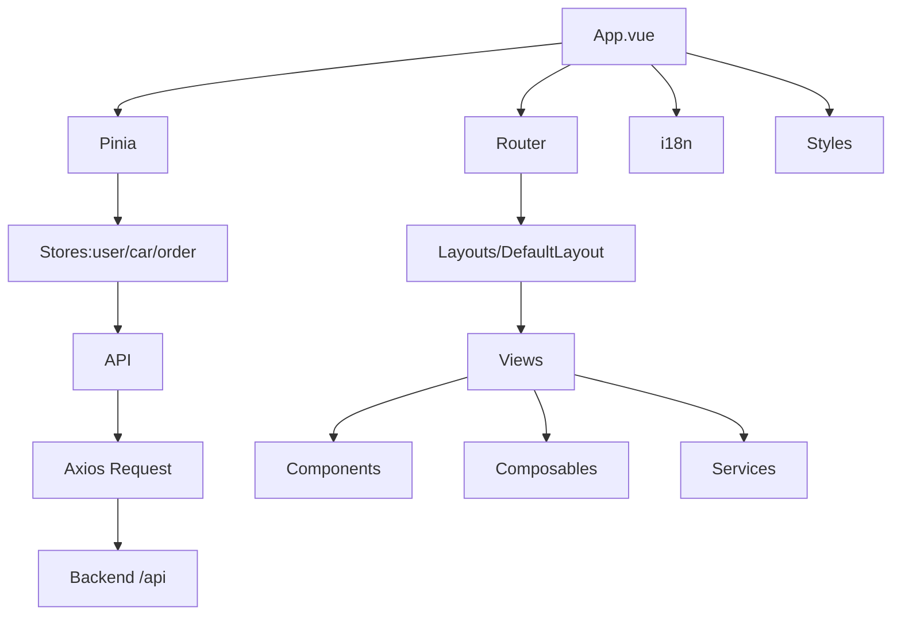
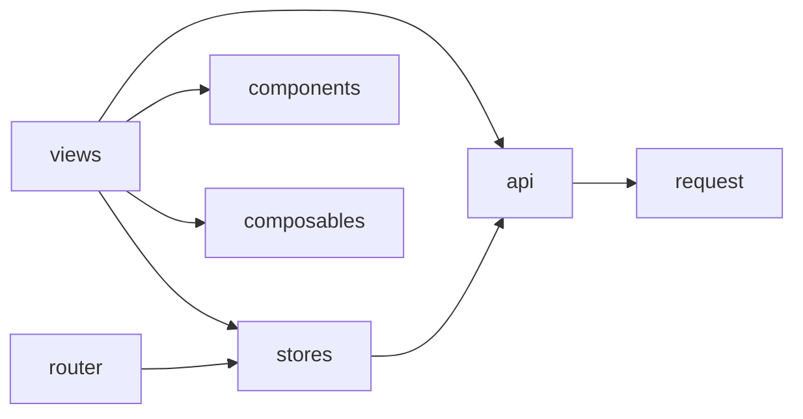
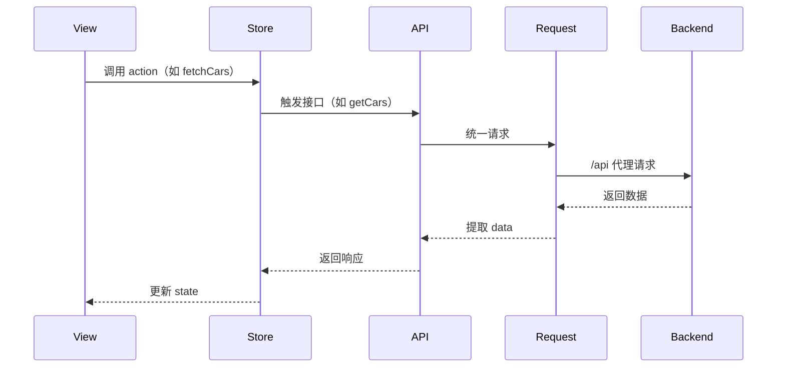

# DESIGN_pc

## 整体架构图

## 分层设计与核心组件
- 表现层：`layouts/`、`views/`、`components/`、`styles/`
- 逻辑层：`composables/`（图片管理等）、`services/`（地址记忆等）
- 状态层：`stores/`（用户、车源、订单）
- 网络层：`api/` + `api/request.ts`（统一请求封装与拦截器）
- 资源层：`locales/`、`types/`、`utils/`

## 模块依赖关系图

## 接口契约定义（示例）
- `GET /cars` → `PageResult<CarListItem>`
- `GET /cars/{id}` → `CarDetail`
- `POST /cars` → `CarDetail`
- `PATCH /cars/{id}/status` → `void`
- `POST /cars/{id}/renew` → `void`
- `POST /orders` → `Order`
- `POST /orders/{id}/pay` → `{ payUrl: string }`

## 数据流向图

## 异常处理策略
- 请求异常分类处理：`401` 清理会话并跳转登录；`403` 权限提示；`404` 资源不存在；`422` 逐项提示；`500` 通用错误
- 上传异常：失败标记并允许恢复；释放 `blob URL` 以避免资源泄漏
- 路由守卫：未登录访问受限页面时统一重定向，并保留回跳路径

