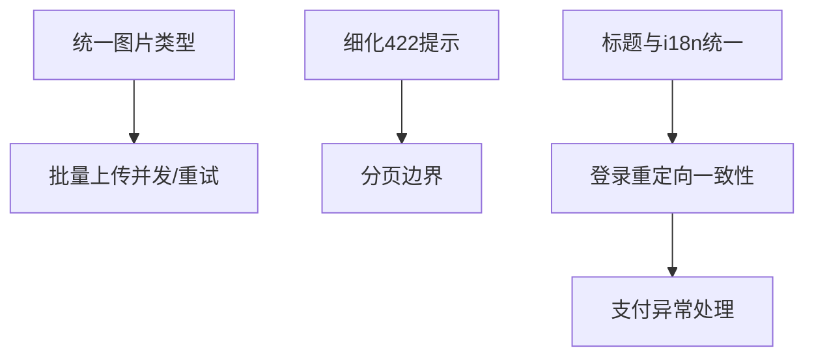

# TASK_pc

## 原子任务清单

### 任务1：统一图片类型定义
- 输入契约：现有 `types/index.ts` 与 `composables/useImageManager.ts` 的类型定义
- 输出契约：在 `types/` 定义唯一 `ImageItem/ImageStatus` 源，其他文件仅引用
- 实现约束：不改动行为，仅消除重复与漂移风险
- 验收标准：项目编译通过；所有引用处类型一致，无重复定义

### 任务2：细化 422 校验提示
- 输入契约：后端返回的 `422` 响应结构（可能含 `details`）
- 输出契约：统一提示策略，逐项提示字段错误，缺省回退到 `message`
- 实现约束：修改 `api/request.ts` 响应拦截器的分支逻辑，保持最小改动
- 验收标准：复杂表单错误有清晰逐项提示；无冗余弹窗

### 任务3：批量上传并发与失败重试
- 输入契约：`uploadImages(files: File[])` 当前串行实现；失败提示策略
- 输出契约：支持并发（可配置并发数）、失败重试（指数退避，最多 N 次）
- 实现约束：资源释放（blob URL）不泄漏；整体结果聚合一致
- 验收标准：弱网与大批量场景上传稳定；失败可重试并有明确提示

### 任务4：路由标题与 i18n 文案统一
- 输入契约：`router/index.ts` 的 `meta.title` 与 `locales/*.json`
- 输出契约：标题来源统一为 i18n key，`document.title` 使用 `t(key)`
- 实现约束：保持原有中文默认值为兜底；不影响守卫逻辑
- 验收标准：语言切换后标题同步变化；键缺失有安全回退

### 任务5：列表分页滚动加载边界处理
- 输入契约：`stores/car.ts` 与 `views/search/index.vue`
- 输出契约：对 `page`、`total`、空列表、重复加载进行防抖与边界保护
- 实现约束：最小化对现有视图改动；状态驱动为主
- 验收标准：滚动加载稳定无重复；空与末页场景体验良好

### 任务6：登录重定向一致性验证与修正
- 输入契约：路由守卫与 `401` 响应拦截器的交互
- 输出契约：统一保留 `redirect` 回跳路径；异常场景不产生循环跳转
- 实现约束：最小改动；优先在拦截器中跳登录，守卫兜底
- 验收标准：所有受限页面均能正确回跳；无循环与错误状态残留

### 任务7：支付跳转异常处理与状态同步
- 输入契约：`payOrder` 返回 `payUrl`
- 输出契约：跳转失败时的提示与回退；状态变更后的列表与详情同步
- 实现约束：保持服务端为真；前端仅提示与刷新
- 验收标准：支付流程可控；异常提示清晰；状态一致

## 任务依赖图

