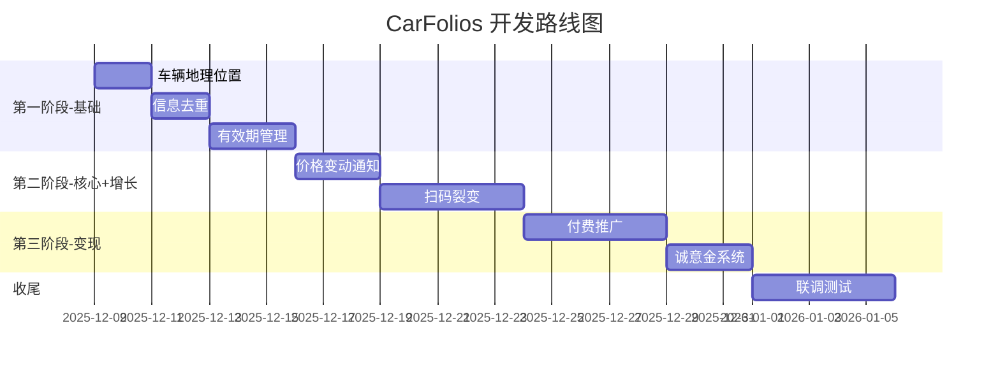

# 📋 CarFolios 需求总览

> **项目名称**：CarFolios - 二手车信息发布平台  
> **创建日期**：2025-12-05  
> **文档版本**：v1.0  
> **状态**：需求收集阶段

---

## 📊 需求清单

| 序号 | 需求名称 | 类型 | 优先级 | 状态 | 创建时间 |
|------|----------|------|--------|------|----------|
| 1 | [车辆地理位置管理系统](#1-车辆地理位置管理系统) | 基础功能 | P0 | 📝 草稿 | 2025-12-05 |
| 2 | [车辆信息去重与防重复发布系统](#2-车辆信息去重与防重复发布系统) | 基础功能 | P0 | 📝 草稿 | 2025-12-05 |
| 3 | [车辆信息有效期管理与自动清理系统](#3-车辆信息有效期管理与自动清理系统) | 基础功能 | P0 | 📝 草稿 | 2025-12-05 |
| 4 | [价格管理与变动通知系统](#4-价格管理与变动通知系统) | 核心功能 | P1 | 📝 草稿 | 2025-12-05 |
| 5 | [扫码即发车-社交裂变获客系统](#5-扫码即发车-社交裂变获客系统) | 增长功能 | P1 | 📝 草稿 | 2025-12-05 |
| 6 | [车辆推广加速-付费曝光提升系统](#6-车辆推广加速-付费曝光提升系统) | 变现功能 | P1 | 📝 草稿 | 2025-12-05 |
| 7 | [车主联系方式付费查看-诚意金系统](#7-车主联系方式付费查看-诚意金系统) | 变现功能 | P1 | 📝 草稿 | 2025-12-05 |

---

## 🎯 需求分类

### 🔧 基础功能（P0 - 必须实现）

| 需求 | 一句话描述 | 核心价值 |
|------|-----------|----------|
| **地理位置** | 车辆所在省市县管理 | 买家按位置筛选车源 |
| **信息去重** | 车架号/车牌号防重复 | 保证数据质量 |
| **有效期管理** | 30天自动过期+续期提醒 | 过滤无效信息 |

### ⭐ 核心功能（P1 - 高优先级）

| 需求 | 一句话描述 | 核心价值 |
|------|-----------|----------|
| **价格变动通知** | 关注车辆价格变动推送 | 提升用户粘性 |

### 🚀 增长功能（P1 - 高优先级）

| 需求 | 一句话描述 | 核心价值 |
|------|-----------|----------|
| **扫码即发车** | 朋友圈扫码→注册→发布 | 病毒式裂变增长 |

### 💰 变现功能（P1 - 高优先级）

| 需求 | 一句话描述 | 核心价值 |
|------|-----------|----------|
| **付费推广** | 5元起置顶首页 | 核心收入来源 |
| **诚意金** | 1元查看联系方式 | 过滤+变现双赢 |

---

## 📝 需求详情

### 1. 车辆地理位置管理系统

| 项目 | 内容 |
|------|------|
| **文档** | [车辆地理位置管理系统-需求规格说明书.md](./车辆地理位置管理系统-需求规格说明书.md) |
| **优先级** | P0 - 必须 |
| **类型** | 基础功能 |
| **简述** | 车辆发布时填写省市县位置，买家可按位置筛选 |
| **核心功能** | 三级联动选择、自动定位、按距离筛选 |

---

### 2. 车辆信息去重与防重复发布系统

| 项目 | 内容 |
|------|------|
| **文档** | [车辆信息去重与防重复发布系统-需求规格说明书.md](./车辆信息去重与防重复发布系统-需求规格说明书.md) |
| **优先级** | P0 - 必须 |
| **类型** | 基础功能 |
| **简述** | 通过车架号/车牌号防止同一车辆重复发布 |
| **核心功能** | VIN校验、车牌校验、重复提示、申诉认领 |

---

### 3. 车辆信息有效期管理与自动清理系统

| 项目 | 内容 |
|------|------|
| **文档** | [车辆信息有效期管理与自动清理系统-需求规格说明书.md](./车辆信息有效期管理与自动清理系统-需求规格说明书.md) |
| **优先级** | P0 - 必须 |
| **类型** | 基础功能 |
| **简述** | 车辆发布30天后自动过期，提醒车主续期或下架 |
| **核心功能** | 30天有效期、过期提醒、一键续期、标记售出 |

---

### 4. 价格管理与变动通知系统

| 项目 | 内容 |
|------|------|
| **文档** | [价格管理与变动通知系统-需求规格说明书.md](./价格管理与变动通知系统-需求规格说明书.md) |
| **优先级** | P1 - 高 |
| **类型** | 核心功能 |
| **简述** | 车主可修改价格，关注该车的买家收到价格变动通知 |
| **核心功能** | 价格修改、变更记录、关注功能、变动推送 |

---

### 5. 扫码即发车-社交裂变获客系统

| 项目 | 内容 |
|------|------|
| **文档** | [扫码即发车-社交裂变获客系统-需求规格说明书.md](./扫码即发车-社交裂变获客系统-需求规格说明书.md) |
| **优先级** | P1 - 高 |
| **类型** | 增长功能 |
| **简述** | 朋友圈看到车辆卡片→扫码→微信登录→发布自己的车 |
| **核心功能** | 带二维码分享卡片、扫码落地页、快速发布、裂变追踪 |
| **增长目标** | K因子 > 1，实现病毒式增长 |

---

### 6. 车辆推广加速-付费曝光提升系统

| 项目 | 内容 |
|------|------|
| **文档** | [车辆推广加速-付费曝光提升系统-需求规格说明书.md](./车辆推广加速-付费曝光提升系统-需求规格说明书.md) |
| **优先级** | P1 - 高 |
| **类型** | 变现功能 |
| **简述** | 车主付费（5-88元）让车辆展示在首页前列 |
| **核心功能** | 4档推广套餐、首页置顶、推广标识、效果统计 |
| **收入预估** | 月收入 ¥30,000+ |

---

### 7. 车主联系方式付费查看-诚意金系统

| 项目 | 内容 |
|------|------|
| **文档** | [车主联系方式付费查看-诚意金系统-需求规格说明书.md](./车主联系方式付费查看-诚意金系统-需求规格说明书.md) |
| **优先级** | P1 - 高 |
| **类型** | 变现功能 |
| **简述** | 买家支付1元诚意金后才能查看车主联系方式 |
| **核心功能** | 联系方式隐藏、1元解锁、永久有效、查看统计 |
| **收入预估** | 月收入 ¥15,000+ |

---

## ⏱️ 开发工时估算

### 假设条件
- **团队配置**：1 全栈开发 + AI 辅助
- **技术栈**：Next.js + Supabase（或类似）
- **每天有效开发**：4-6 小时

### 各功能工时

| 序号 | 功能 | 前端 | 后端 | 测试 | 总计 | 难度 |
|------|------|------|------|------|------|------|
| 1 | 地理位置管理 | 1天 | 0.5天 | 0.5天 | **2天** | ⭐⭐ |
| 2 | 信息去重 | 0.5天 | 1天 | 0.5天 | **2天** | ⭐⭐ |
| 3 | 有效期管理 | 1天 | 1.5天 | 0.5天 | **3天** | ⭐⭐⭐ |
| 4 | 价格变动通知 | 1天 | 1.5天 | 0.5天 | **3天** | ⭐⭐⭐ |
| 5 | 扫码裂变 | 2天 | 2天 | 1天 | **5天** | ⭐⭐⭐⭐ |
| 6 | 付费推广 | 1.5天 | 2天 | 1天 | **4.5天** | ⭐⭐⭐⭐ |
| 7 | 诚意金系统 | 1天 | 1.5天 | 0.5天 | **3天** | ⭐⭐⭐ |

### 总工时汇总

| 类别 | 功能 | 工时 |
|------|------|------|
| 基础功能 | 地理位置 + 去重 + 有效期 | 7 天 |
| 核心功能 | 价格通知 | 3 天 |
| 增长功能 | 扫码裂变 | 5 天 |
| 变现功能 | 推广 + 诚意金 | 7.5 天 |
| 联调测试 | 整体联调 | 2 天 |
| Buffer | 意外情况 | 3 天 |
| | **总计** | **~28 天** |

---

## 📅 开发路线图

### 里程碑

| 阶段 | 时间 | 需求 | 里程碑 |
|------|------|------|--------|
| **Week 1** | 12.09 - 12.15 | 地理位置、去重、有效期 | ✅ MVP 可发布车辆 |
| **Week 2** | 12.16 - 12.22 | 价格通知、扫码裂变 | 🚀 增长引擎上线 |
| **Week 3** | 12.23 - 12.29 | 付费推广、诚意金 | 💰 变现闭环 |
| **Week 4** | 12.30 - 01.05 | 联调测试、Bug 修复 | 🎉 正式上线 |

### ⚠️ 风险点

| 风险 | 影响 | 应对 |
|------|------|------|
| 微信支付接入 | +2-3天 | 提前申请商户号 |
| 公众号配置 | +1-2天 | 需要认证服务号 |
| 行政区划数据 | +0.5天 | 用现成开源数据 |

**乐观估计**：3-4 周 | **保守估计**：5-6 周

---

## 💡 后续待规划需求

- [ ] 用户认证体系（实名认证、车商认证）
- [ ] 站内消息/IM 聊天
- [ ] 车辆收藏夹
- [ ] 搜索与筛选（品牌、价格区间、年份等）
- [ ] 车辆详情页优化（多图、视频）
- [ ] 数据统计后台
- [ ] 举报与审核机制

---

## 📎 文档索引

| 文档 | 路径 |
|------|------|
| 需求总览（本文档） | `CarFolios-需求总览.md` |
| 地理位置需求 | `车辆地理位置管理系统-需求规格说明书.md` |
| 去重需求 | `车辆信息去重与防重复发布系统-需求规格说明书.md` |
| 有效期需求 | `车辆信息有效期管理与自动清理系统-需求规格说明书.md` |
| 价格通知需求 | `价格管理与变动通知系统-需求规格说明书.md` |
| 裂变增长需求 | `扫码即发车-社交裂变获客系统-需求规格说明书.md` |
| 付费推广需求 | `车辆推广加速-付费曝光提升系统-需求规格说明书.md` |
| 诚意金需求 | `车主联系方式付费查看-诚意金系统-需求规格说明书.md` |

---

> **更新记录**  
> - 2025-12-05：创建文档，收录 7 个需求
