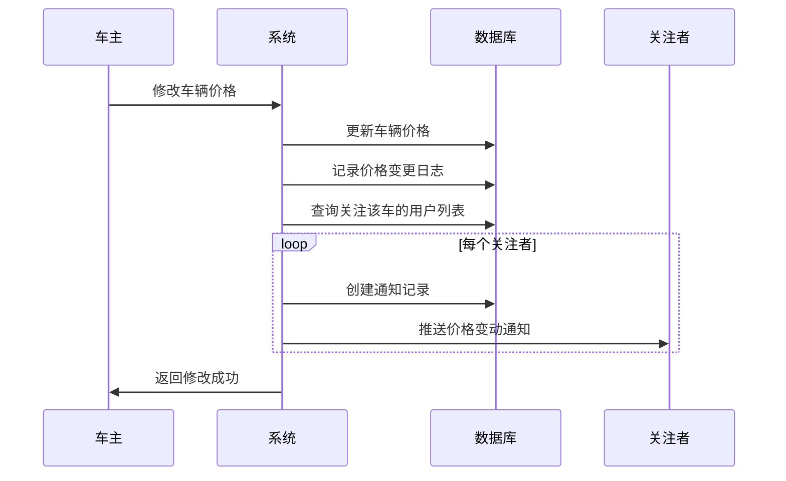

# 📋 需求规格说明书

## 功能名称
**车辆价格管理与变动通知系统**

---

## 1. 功能概述

### 1.1 业务背景
车辆价格会随市场行情、车况变化等因素波动，车主需要能够自主更新报价。同时，关注该车辆的潜在买家应及时获知价格变动，以便做出购买决策。

### 1.2 核心价值
- **车主侧**：灵活调整报价，保持价格竞争力
- **买家侧**：实时掌握关注车辆的价格动态，不错过心仪车辆的降价机会

---

## 2. 功能需求

### 2.1 价格修改功能

| 项目 | 说明 |
|------|------|
| **操作角色** | 车辆所有者（车主） |
| **触发条件** | 车主进入自己车辆的详情页/管理页 |
| **核心操作** | 修改车辆报价（支持调高/调低） |
| **数据记录** | 记录价格变更历史（原价、新价、变更时间） |

### 2.2 价格变动通知功能

| 项目 | 说明 |
|------|------|
| **触发条件** | 车辆价格发生变更 |
| **通知对象** | 所有「关注」该车辆的用户 |
| **通知内容** | 车辆名称、原价格、新价格、变动幅度（涨/跌） |
| **通知渠道** | 站内消息 / Push 通知 / 邮件（可配置） |

---

## 3. 用户故事

### Story 1: 车主修改价格
```
作为【车主】
我希望【能够修改我发布车辆的报价】
以便【根据市场行情灵活调整，提高成交率】
```

### Story 2: 买家接收价格变动通知
```
作为【潜在买家】
我希望【当我关注的车辆价格变动时收到通知】
以便【第一时间知道降价信息，抓住购买时机】
```

---

## 4. 数据模型设计（建议）

### 4.1 价格变更记录表 `price_change_log`

| 字段 | 类型 | 说明 |
|------|------|------|
| `id` | UUID | 主键 |
| `car_id` | UUID | 关联车辆 |
| `old_price` | Decimal | 原价格 |
| `new_price` | Decimal | 新价格 |
| `changed_by` | UUID | 操作人（车主） |
| `changed_at` | Timestamp | 变更时间 |

### 4.2 用户关注表 `user_car_follows`

| 字段 | 类型 | 说明 |
|------|------|------|
| `id` | UUID | 主键 |
| `user_id` | UUID | 关注者 |
| `car_id` | UUID | 被关注车辆 |
| `created_at` | Timestamp | 关注时间 |

### 4.3 通知表 `notifications`

| 字段 | 类型 | 说明 |
|------|------|------|
| `id` | UUID | 主键 |
| `user_id` | UUID | 接收者 |
| `type` | Enum | 通知类型（price_change） |
| `payload` | JSON | 通知内容 |
| `is_read` | Boolean | 是否已读 |
| `created_at` | Timestamp | 创建时间 |

---

## 5. 业务流程



---

## 6. 验收标准（Acceptance Criteria）

### AC1: 价格修改
- [ ] 车主可以在车辆管理页修改价格
- [ ] 价格修改后立即生效
- [ ] 系统记录价格变更历史

### AC2: 通知推送
- [ ] 价格变动后，所有关注者在 5 秒内收到通知
- [ ] 通知内容包含：车辆名称、原价、新价、变动方向（涨/跌）
- [ ] 用户可在通知中心查看历史通知

### AC3: 边界情况
- [ ] 价格未变化时不触发通知
- [ ] 关注者为 0 时正常执行，不报错

---

## 7. 技术实现建议

| 模块 | 推荐方案 |
|------|----------|
| **实时通知** | WebSocket / Server-Sent Events |
| **消息队列** | 价格变更事件 → 异步处理通知 |
| **通知存储** | 数据库 + Redis 缓存未读数 |

---

## 8. 优先级与里程碑

| 阶段 | 功能 | 优先级 |
|------|------|--------|
| **P0** | 车主修改价格 | 必须 |
| **P0** | 价格变更记录 | 必须 |
| **P1** | 关注车辆功能 | 高 |
| **P1** | 价格变动站内通知 | 高 |
| **P2** | Push / 邮件通知 | 中 |
| **P2** | 价格历史曲线图 | 中 |

---

## 文档信息

| 项目 | 内容 |
|------|------|
| **创建日期** | 2025-12-05 |
| **版本** | v1.0 |
| **状态** | 草稿 |
