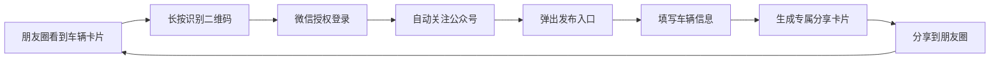
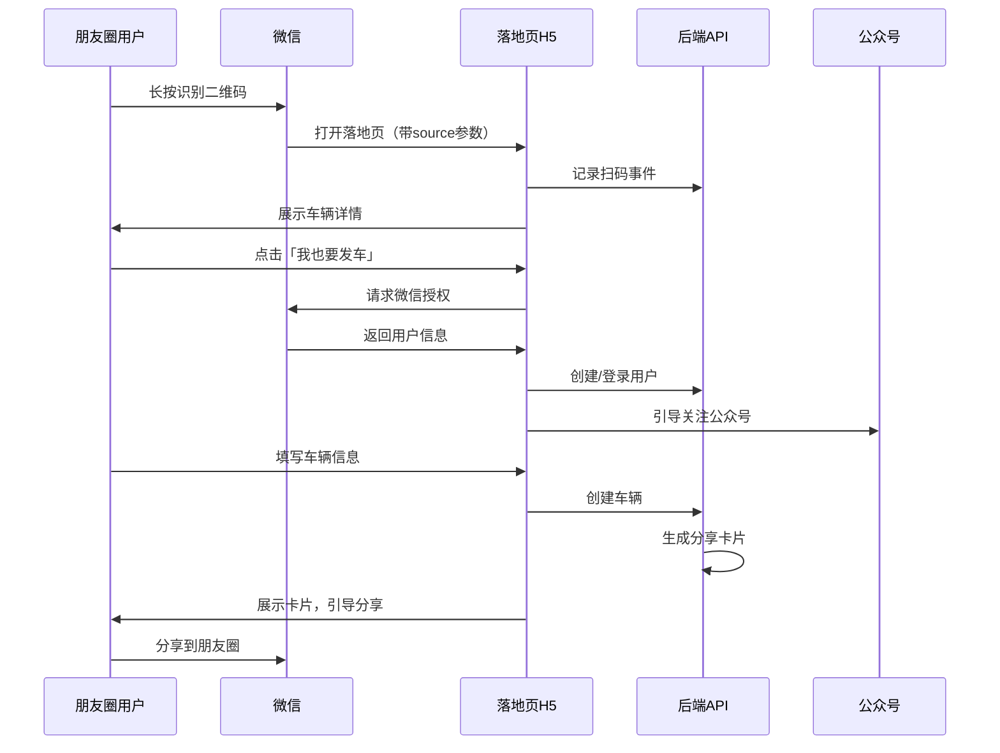

# 📋 需求规格说明书

## 功能名称
**扫码即发车 - 社交裂变获客系统**

---

## 1. 功能概述

### 1.1 业务背景
用户在微信朋友圈看到好友分享的二手车信息，产生兴趣后希望：
1. 快速成为平台用户
2. 立即发布自己的车辆信息

传统流程（下载 App → 注册 → 登录 → 发布）转化率极低。需要设计**零摩擦**的裂变路径。

### 1.2 核心价值
- **增长飞轮**：看车 → 扫码 → 发车 → 被看 → 更多人扫码（滚雪球效应）
- **获客成本**：趋近于零（用户自发传播）
- **转化率**：缩短用户旅程，提升注册→发布转化率

---

## 2. 用户旅程设计

### 2.1 理想路径（3 步完成）



### 2.2 关键设计点

| 环节 | 设计要点 | 目的 |
|------|----------|------|
| **二维码** | 嵌入在车辆卡片图片中 | 朋友圈可直接长按识别 |
| **落地页** | 微信 H5，无需下载 App | 降低门槛 |
| **授权** | 微信一键登录，无需填手机号 | 减少流失 |
| **关注** | 授权后自动引导关注公众号 | 沉淀私域流量 |
| **发布入口** | 登录后立即弹出「我也要发车」 | 趁热打铁 |
| **分享卡片** | 发布成功自动生成带二维码的图片 | 闭环裂变 |

---

## 3. 用户故事

### Story 1: 潜在卖家扫码发车
```
作为【朋友圈浏览者】
我希望【扫码后能快速发布我的车辆信息】
以便【不用繁琐注册流程，立即参与卖车】
```

### Story 2: 现有用户分享裂变
```
作为【已发布车辆的车主】
我希望【我的车辆卡片自带二维码】
以便【朋友看到后能快速加入平台，扩大曝光】
```

---

## 4. 功能需求

### 4.1 车辆分享卡片

| 元素 | 说明 |
|------|------|
| **车辆主图** | 高清大图，吸引眼球 |
| **关键信息** | 车型、年份、里程、价格 |
| **车主头像** | 增加信任感 |
| **平台 Logo** | 品牌露出 |
| **二维码** | 带参数，可追踪来源 |
| **行动号召** | "扫码查看详情 / 我也要发车" |

**示意图**：
```
┌─────────────────────────────┐
│  [车辆主图 - 高清大图]       │
├─────────────────────────────┤
│  🚗 2022 保时捷 911          │
│  📍 上海 | 1.2万公里         │
│  💰 ¥1,280,000              │
├──────────────────┬──────────┤
│  👤 张先生        │ [二维码] │
│  CarFolios       │  扫码    │
│                  │  发车    │
└──────────────────┴──────────┘
```

### 4.2 扫码落地页

| 状态 | 页面内容 |
|------|----------|
| **未登录** | 车辆详情 + 微信授权登录按钮 |
| **已登录** | 车辆详情 + 「我也要发车」悬浮按钮 |
| **授权后** | 引导关注公众号弹窗 |

### 4.3 快速发布流程

| 步骤 | 内容 | 优化点 |
|------|------|--------|
| 1 | 上传车辆照片 | 支持多图批量上传 |
| 2 | 填写基本信息 | 车型支持搜索联想 |
| 3 | 设置价格 | 提供市场参考价 |
| 4 | 预览 & 发布 | 一键生成分享卡片 |

---

## 5. 数据模型设计

### 5.1 二维码追踪表 `qrcode_scans`

| 字段 | 类型 | 说明 |
|------|------|------|
| `id` | UUID | 主键 |
| `source_car_id` | UUID | 来源车辆（谁的卡片被扫） |
| `source_user_id` | UUID | 来源用户（谁分享的） |
| `scanned_user_id` | UUID | 扫码用户（谁扫的） |
| `scanned_at` | Timestamp | 扫码时间 |
| `converted` | Boolean | 是否转化（发布了车辆） |

### 5.2 裂变关系表 `user_referrals`

| 字段 | 类型 | 说明 |
|------|------|------|
| `id` | UUID | 主键 |
| `referrer_id` | UUID | 推荐人 |
| `referee_id` | UUID | 被推荐人 |
| `source_type` | Enum | 来源类型（qrcode/link/...） |
| `created_at` | Timestamp | 建立时间 |

---

## 6. 业务流程



---

## 7. 验收标准

### AC1: 分享卡片
- [ ] 车辆详情页可生成带二维码的分享图片
- [ ] 二维码包含来源追踪参数
- [ ] 图片可保存到相册 / 直接分享

### AC2: 扫码体验
- [ ] 微信内长按可识别二维码
- [ ] 落地页加载时间 < 2 秒
- [ ] 微信授权一键登录，无需手机号

### AC3: 发布转化
- [ ] 登录后 3 秒内展示「我也要发车」入口
- [ ] 发布流程 < 5 步完成
- [ ] 发布成功自动生成分享卡片

### AC4: 数据追踪
- [ ] 可统计每个用户带来的扫码量
- [ ] 可统计扫码→注册→发布的转化漏斗

---

## 8. 增长指标（北极星）

| 指标 | 定义 | 目标 |
|------|------|------|
| **K 因子** | 每个用户带来的新用户数 | > 1（病毒式增长） |
| **扫码转化率** | 扫码 → 注册 | > 30% |
| **发布转化率** | 注册 → 发布车辆 | > 20% |
| **分享率** | 发布 → 分享到朋友圈 | > 50% |

---

## 9. 技术实现建议

| 模块 | 方案 |
|------|------|
| **二维码生成** | 带参数的微信公众号二维码 / 小程序码 |
| **落地页** | 微信 H5（Vue/React） |
| **授权登录** | 微信网页授权（OAuth 2.0） |
| **图片生成** | Canvas 服务端渲染 / html2canvas |
| **数据埋点** | 神策 / GrowingIO / 自建 |

---

## 10. 优先级

| 阶段 | 功能 | 优先级 |
|------|------|--------|
| **P0** | 车辆分享卡片（带二维码） | 必须 |
| **P0** | 扫码落地页 + 微信授权 | 必须 |
| **P0** | 快速发布流程 | 必须 |
| **P1** | 公众号关注引导 | 高 |
| **P1** | 裂变数据追踪 | 高 |
| **P2** | 推荐奖励机制 | 中 |

---

## 文档信息

| 项目 | 内容 |
|------|------|
| **创建日期** | 2025-12-05 |
| **版本** | v1.0 |
| **状态** | 草稿 |
