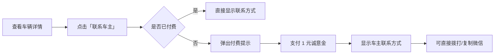
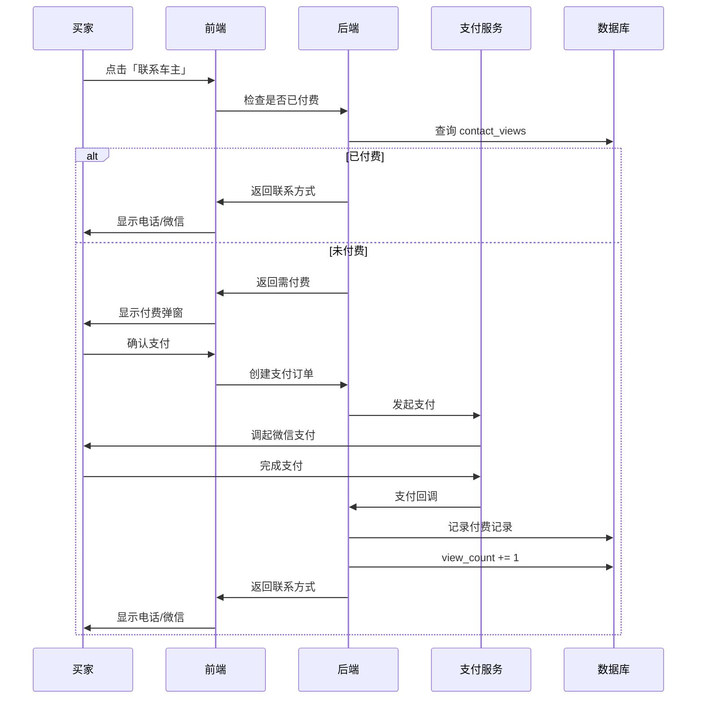

# 📋 需求规格说明书

## 功能名称
**车主联系方式付费查看 - 诚意金系统**

---

## 1. 功能概述

### 1.1 业务背景
- 车主经常被无效咨询骚扰（随便问问、比价党）
- 买家获取联系方式太容易，缺乏筛选机制
- 平台需要可持续的变现模式

### 1.2 核心价值
- **车主侧**：过滤无效咨询，收到的都是有诚意的买家
- **买家侧**：1 元门槛极低，证明购买诚意
- **平台侧**：高频小额变现，积少成多

### 1.3 心理学设计
> **1 元诚意金的妙处**：
> - 金额小到不会阻挡真正想买的人
> - 但足以过滤掉「随便看看」的人
> - 付费后买家会更认真对待这次咨询

---

## 2. 功能设计

### 2.1 用户流程



### 2.2 界面设计

**未付费状态**：
```
┌─────────────────────────────────┐
│  📞 联系车主                     │
├─────────────────────────────────┤
│                                 │
│     🔒 联系方式已隐藏            │
│                                 │
│  支付 ¥1 诚意金，查看车主电话    │
│  过滤无效咨询，保护双方时间      │
│                                 │
│  ┌─────────────────────────┐   │
│  │     💰 支付 1 元查看      │   │
│  └─────────────────────────┘   │
│                                 │
│  已有 128 人查看了联系方式       │
└─────────────────────────────────┘
```

**已付费状态**：
```
┌─────────────────────────────────┐
│  📞 联系车主                     │
├─────────────────────────────────┤
│                                 │
│  📱 138****8888    [拨打]       │
│                                 │
│  💬 微信: zhangsan  [复制]      │
│                                 │
│  ⏰ 建议联系时间: 9:00-21:00    │
│                                 │
└─────────────────────────────────┘
```

### 2.3 付费规则

| 规则 | 说明 |
|------|------|
| **单次付费** | 1 元/次，仅对当前车辆有效 |
| **永久有效** | 付费后永久可查看该车联系方式 |
| **不可退款** | 虚拟服务，付费后不退 |
| **车主免费** | 车主查看自己的车不收费 |

### 2.4 可选套餐（P2）

| 套餐 | 价格 | 说明 |
|------|------|------|
| **单次查看** | ¥1 | 查看 1 辆车的联系方式 |
| **月度会员** | ¥9.9 | 当月无限查看 |
| **年度会员** | ¥49 | 全年无限查看 |

---

## 3. 用户故事

### Story 1: 买家付费查看
```
作为【买家】
我希望【支付 1 元后能看到车主联系方式】
以便【直接联系车主，了解车况】
```

### Story 2: 车主收到诚意咨询
```
作为【车主】
我希望【联系我的买家都付过诚意金】
以便【减少无效咨询，提高沟通效率】
```

### Story 3: 买家再次查看
```
作为【买家】
我希望【付费后能永久查看该车联系方式】
以便【多次联系车主不用重复付费】
```

---

## 4. 数据模型设计

### 4.1 联系方式查看记录表 `contact_views`

| 字段 | 类型 | 说明 |
|------|------|------|
| `id` | UUID | 主键 |
| `car_id` | UUID | 车辆 ID |
| `viewer_id` | UUID | 查看者（买家）ID |
| `owner_id` | UUID | 车主 ID |
| `amount` | Decimal | 支付金额（分） |
| `order_no` | String | 支付订单号 |
| `status` | Enum | 状态（pending/paid/refunded） |
| `created_at` | Timestamp | 创建时间 |
| `paid_at` | Timestamp | 支付时间 |

### 4.2 车辆表扩展

| 字段 | 类型 | 说明 |
|------|------|------|
| `contact_phone` | String | 联系电话 |
| `contact_wechat` | String | 微信号（可选） |
| `contact_time` | String | 建议联系时间 |
| `view_count` | Integer | 联系方式被查看次数 |

---

## 5. 业务流程

### 5.1 付费查看流程



---

## 6. 验收标准

### AC1: 付费流程
- [ ] 未付费用户看到联系方式为隐藏状态
- [ ] 点击后弹出付费提示
- [ ] 支持微信支付
- [ ] 支付成功后立即显示联系方式

### AC2: 查看权限
- [ ] 付费后永久可查看该车联系方式
- [ ] 车主查看自己的车不收费
- [ ] 同一用户对同一车辆只收一次费

### AC3: 数据统计
- [ ] 车主可看到有多少人查看了联系方式
- [ ] 平台可统计诚意金收入

### AC4: 异常处理
- [ ] 支付失败时提示重试
- [ ] 车辆下架后，已付费用户仍可查看

---

## 7. 收入预估

| 假设 | 数值 |
|------|------|
| 日活车辆数 | 1,000 |
| 日均详情页 PV | 5,000 |
| 付费转化率 | 10% |
| 客单价 | ¥1 |
| **日收入** | **¥500** |
| **月收入** | **¥15,000** |

---

## 8. 运营策略

| 策略 | 说明 |
|------|------|
| **首单免费** | 新用户首次查看免费，培养习惯 |
| **分成机制** | 诚意金可部分分给车主（如 0.5 元） |
| **查看提醒** | 有人查看联系方式时通知车主 |
| **诚意排行** | 展示「最多人想联系」的车辆 |

---

## 9. 技术实现建议

| 模块 | 方案 |
|------|------|
| **支付** | 微信小额支付（免密支付体验更好） |
| **权限校验** | 每次请求校验是否已付费 |
| **缓存** | Redis 缓存付费记录，减少 DB 查询 |

---

## 10. 优先级

| 阶段 | 功能 | 优先级 |
|------|------|--------|
| **P0** | 联系方式隐藏展示 | 必须 |
| **P0** | 1 元付费解锁 | 必须 |
| **P0** | 付费记录持久化 | 必须 |
| **P1** | 查看次数统计 | 高 |
| **P1** | 车主收到查看通知 | 高 |
| **P2** | 会员套餐 | 中 |
| **P2** | 车主分成 | 中 |

---

## 文档信息

| 项目 | 内容 |
|------|------|
| **创建日期** | 2025-12-05 |
| **版本** | v1.0 |
| **状态** | 草稿 |
