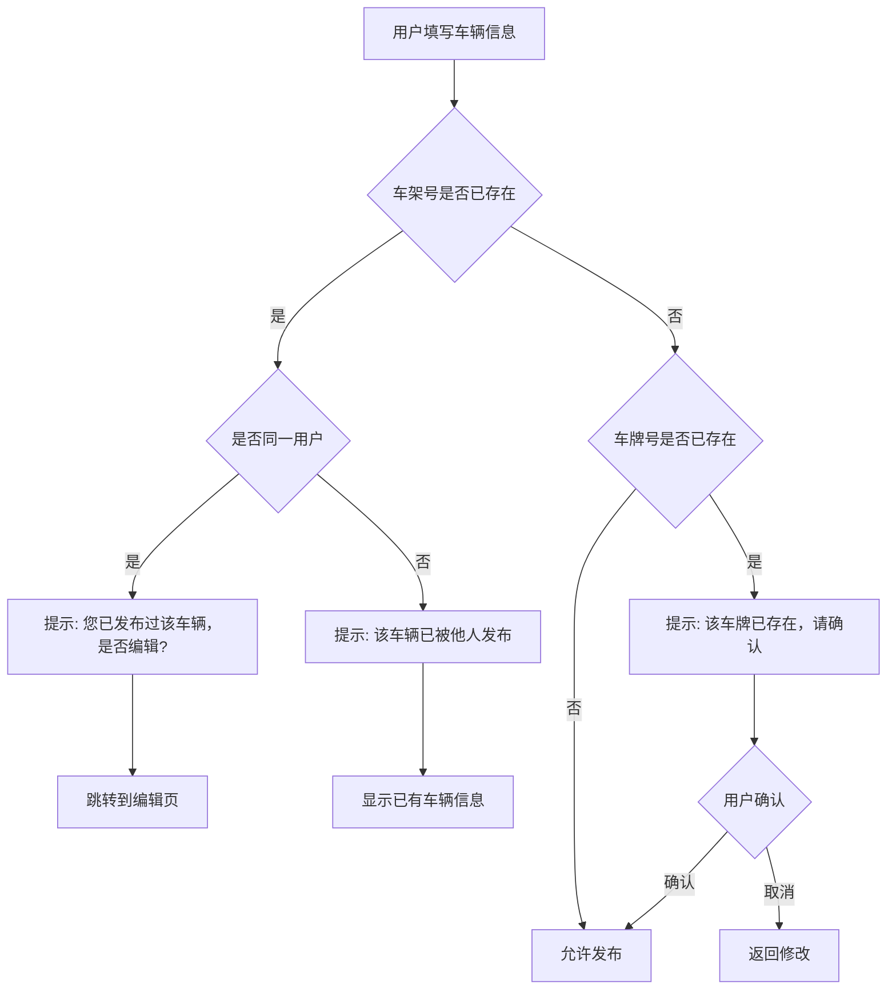
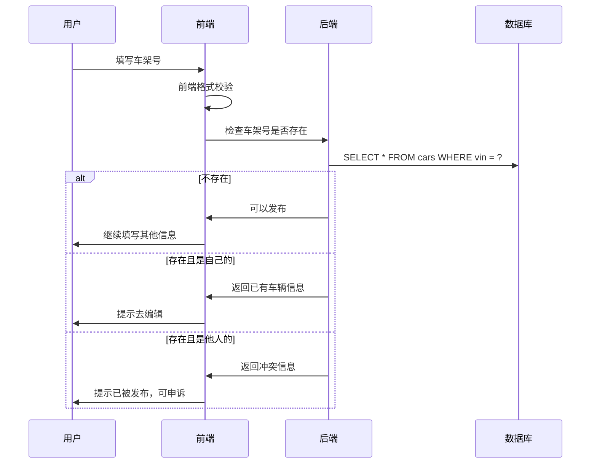
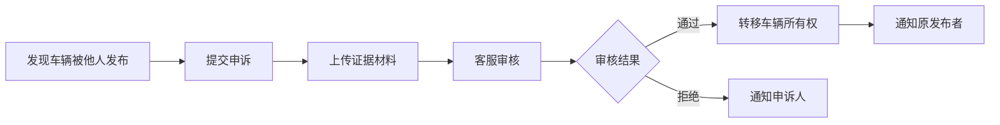

# 📋 需求规格说明书

## 功能名称
**车辆信息去重与防重复发布系统**

---

## 1. 功能概述

### 1.1 业务背景
- 同一辆车可能被多人发布（车贩子、中介）
- 车主可能重复发布同一辆车
- 重复信息影响买家体验，造成信息冗余

### 1.2 核心价值
- **买家侧**：避免看到重复车源，节省筛选时间
- **车主侧**：保护原始发布者权益
- **平台侧**：保证数据质量，提升可信度

---

## 2. 唯一性标识设计

### 2.1 车辆唯一标识

| 标识 | 唯一性 | 说明 |
|------|--------|------|
| **车架号（VIN）** | ✅ 全球唯一 | 17 位，最可靠的唯一标识 |
| **车牌号** | ⚠️ 地区唯一 | 可变更，但短期内可作为辅助判断 |
| **发动机号** | ✅ 唯一 | 可作为辅助验证 |

### 2.2 去重策略

| 优先级 | 规则 | 处理方式 |
|--------|------|----------|
| **1** | 车架号（VIN）完全相同 | 🚫 禁止发布 |
| **2** | 车牌号相同 | ⚠️ 提示确认 |
| **3** | 同用户重复发布 | 🚫 禁止，引导编辑 |

---

## 3. 功能需求

### 3.1 发布时校验



### 3.2 提示文案设计

**车架号重复（他人发布）**：
```
┌─────────────────────────────────┐
│  ⚠️ 该车辆已被发布               │
├─────────────────────────────────┤
│                                 │
│  车架号 LSVAU2180N2XXXXXX       │
│  已于 2025-12-01 被其他用户发布  │
│                                 │
│  如果您是车主，可以：            │
│  • 联系客服申诉                  │
│  • 提供购车凭证认领车辆          │
│                                 │
│  [查看该车辆]  [联系客服]        │
└─────────────────────────────────┘
```

**车架号重复（自己发布）**：
```
┌─────────────────────────────────┐
│  💡 您已发布过该车辆             │
├─────────────────────────────────┤
│                                 │
│  车架号 LSVAU2180N2XXXXXX       │
│  发布于 2025-12-01              │
│                                 │
│  无需重复发布，您可以：          │
│  • 编辑更新车辆信息              │
│  • 调整价格                      │
│  • 续期延长展示                  │
│                                 │
│  [去编辑]  [查看车辆]            │
└─────────────────────────────────┘
```

**车牌号重复**：
```
┌─────────────────────────────────┐
│  ⚠️ 车牌号已存在                 │
├─────────────────────────────────┤
│                                 │
│  车牌号 沪A·12345 已被发布       │
│                                 │
│  可能原因：                      │
│  • 车牌输入错误                  │
│  • 该车已被他人发布              │
│                                 │
│  [返回修改]  [确认无误，继续]    │
└─────────────────────────────────┘
```

### 3.3 车架号格式校验

| 规则 | 说明 |
|------|------|
| **长度** | 必须 17 位 |
| **字符** | 数字 + 大写字母（不含 I、O、Q） |
| **校验位** | 第 9 位为校验位，可验证真伪 |

```javascript
// VIN 校验正则
const VIN_REGEX = /^[A-HJ-NPR-Z0-9]{17}$/;

// VIN 校验位验证（可选，更严格）
function validateVIN(vin) {
  // 实现 VIN 校验位算法
}
```

### 3.4 车牌号格式校验

| 类型 | 格式 | 示例 |
|------|------|------|
| **普通车牌** | 省份简称 + 字母 + 5位 | 沪A·12345 |
| **新能源** | 省份简称 + 字母 + 6位 | 沪AD·12345 |
| **特殊车牌** | 军牌、警牌等 | 按实际格式 |

---

## 4. 用户故事

### Story 1: 防止重复发布
```
作为【车主】
我希望【系统阻止我重复发布同一辆车】
以便【避免产生重复信息，直接编辑已有记录】
```

### Story 2: 防止他人盗发
```
作为【车主】
我希望【我的车不被他人冒名发布】
以便【保护我的车辆信息和权益】
```

### Story 3: 申诉认领
```
作为【真正的车主】
我希望【能申诉认领被他人发布的车辆】
以便【获得车辆的管理权】
```

---

## 5. 数据模型设计

### 5.1 车辆表唯一约束

```sql
-- 车架号唯一索引
CREATE UNIQUE INDEX idx_cars_vin ON cars(vin) WHERE vin IS NOT NULL;

-- 车牌号 + 状态联合索引（允许已下架的重复）
CREATE UNIQUE INDEX idx_cars_plate_active 
ON cars(plate_number) 
WHERE status IN ('on_sale', 'expiring');
```

### 5.2 车辆表扩展字段

| 字段 | 类型 | 说明 |
|------|------|------|
| `vin` | String(17) | 车架号，唯一 |
| `plate_number` | String(10) | 车牌号 |
| `engine_number` | String | 发动机号（可选） |
| `vin_verified` | Boolean | 车架号是否已验证 |

### 5.3 申诉记录表 `car_claims`

| 字段 | 类型 | 说明 |
|------|------|------|
| `id` | UUID | 主键 |
| `car_id` | UUID | 被申诉的车辆 |
| `claimant_id` | UUID | 申诉人 |
| `evidence` | JSON | 证据材料（图片链接） |
| `status` | Enum | 状态（pending/approved/rejected） |
| `reason` | String | 申诉理由 |
| `admin_note` | String | 管理员备注 |
| `created_at` | Timestamp | 申诉时间 |
| `resolved_at` | Timestamp | 处理时间 |

---

## 6. 业务流程

### 6.1 发布校验流程



### 6.2 申诉认领流程



---

## 7. 验收标准

### AC1: 车架号去重
- [ ] 车架号格式校验（17 位，合法字符）
- [ ] 同一车架号禁止重复发布
- [ ] 自己重复发布时引导去编辑

### AC2: 车牌号去重
- [ ] 车牌号格式校验
- [ ] 车牌号重复时提示确认
- [ ] 用户确认后可继续发布

### AC3: 申诉机制
- [ ] 提供申诉入口
- [ ] 支持上传证据材料
- [ ] 客服可审核处理

### AC4: 边界情况
- [ ] 已下架/过期车辆不参与去重
- [ ] 车架号为空时跳过校验（但建议填写）

---

## 8. 技术实现建议

| 模块 | 方案 |
|------|------|
| **格式校验** | 前端正则 + 后端二次校验 |
| **唯一性校验** | 数据库唯一索引 + 应用层预检 |
| **并发控制** | 乐观锁 / 分布式锁防止并发插入 |
| **VIN 解码** | 可接入第三方 VIN 解码服务，获取车辆信息 |

### 8.1 VIN 解码增值服务（P2）

通过 VIN 可自动获取：
- 品牌、车型、年款
- 发动机类型
- 生产厂商
- 出厂日期

---

## 9. 优先级

| 阶段 | 功能 | 优先级 |
|------|------|--------|
| **P0** | 车架号格式校验 | 必须 |
| **P0** | 车架号唯一性校验 | 必须 |
| **P0** | 重复发布引导编辑 | 必须 |
| **P1** | 车牌号格式校验 | 高 |
| **P1** | 车牌号重复提示 | 高 |
| **P2** | 申诉认领机制 | 中 |
| **P2** | VIN 自动解码 | 中 |

---

## 文档信息

| 项目 | 内容 |
|------|------|
| **创建日期** | 2025-12-05 |
| **版本** | v1.0 |
| **状态** | 草稿 |
