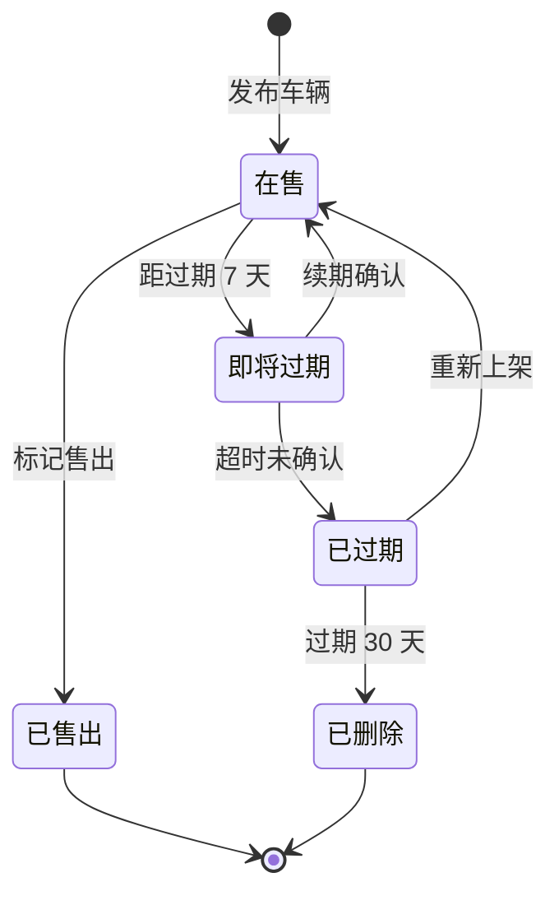
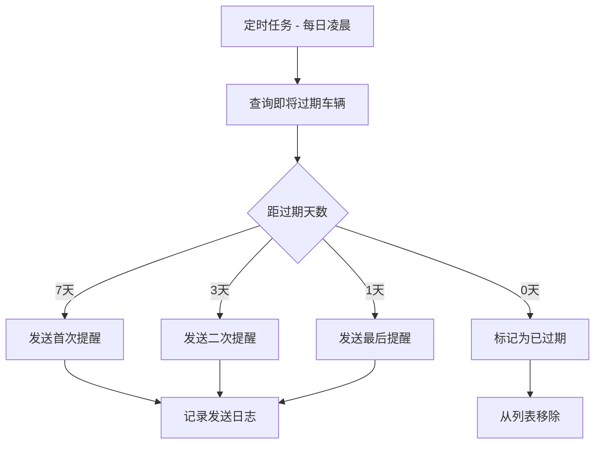
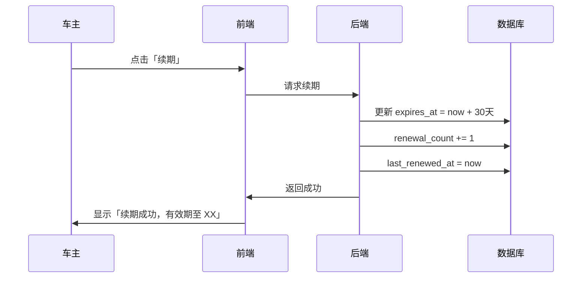

# 📋 需求规格说明书

## 功能名称
**车辆信息有效期管理与自动清理系统**

---

## 1. 功能概述

### 1.1 业务背景
二手车信息有时效性：
- 车辆可能已售出但车主忘记下架
- 长期未更新的信息可能已过时（价格、车况）
- 无效信息影响买家体验，降低平台可信度

### 1.2 核心价值
- **买家侧**：看到的都是真实有效的在售车辆
- **车主侧**：提醒续期，避免错过潜在买家
- **平台侧**：保持信息新鲜度，提升平台质量

---

## 2. 生命周期设计

### 2.1 车辆状态流转



### 2.2 时间节点设计

| 节点 | 时间 | 动作 |
|------|------|------|
| **发布** | T+0 | 车辆上架，状态=在售 |
| **首次提醒** | T+23天 | 推送「即将过期」通知 |
| **二次提醒** | T+27天 | 推送「明天过期」通知 |
| **三次提醒** | T+30天 | 推送「今日过期」通知 |
| **自动过期** | T+30天 | 状态=已过期，不再展示 |
| **彻底清理** | T+60天 | 已过期车辆移入归档/删除 |

---

## 3. 功能需求

### 3.1 过期提醒

| 渠道 | 内容 |
|------|------|
| **站内消息** | 「您的车辆 [车型] 将于 X 天后过期，点击续期」 |
| **公众号推送** | 模板消息提醒 |
| **短信**（可选） | 最后一天发送短信提醒 |

**提醒消息示例**：
```
🚗 您的爱车即将下架

您发布的「2022 保时捷 911」将于 3 天后过期。
如果车辆仍在售，请点击续期，继续展示给买家。

[一键续期]  [已售出，下架]
```

### 3.2 续期操作

| 操作 | 说明 |
|------|------|
| **一键续期** | 点击后延长 30 天有效期 |
| **更新信息** | 续期时可选择更新价格等信息 |
| **标记售出** | 车辆已售，主动下架 |

### 3.3 过期处理

| 状态 | 展示规则 |
|------|----------|
| **在售** | 正常展示在列表 |
| **即将过期** | 正常展示，车主端显示提醒标识 |
| **已过期** | 不在列表展示，车主可在「我的车辆」看到 |
| **已删除** | 彻底不可见 |

### 3.4 车主端展示

**我的车辆列表**：
```
┌─────────────────────────────────────┐
│  我的车辆                            │
├─────────────────────────────────────┤
│  ┌─────────┐                        │
│  │ 保时捷   │  在售中 · 剩余 25 天   │
│  │ ¥128万   │  [续期] [下架]         │
│  └─────────┘                        │
├─────────────────────────────────────┤
│  ┌─────────┐                        │
│  │ 宝马 5系 │  ⚠️ 即将过期 · 剩余 3 天│
│  │ ¥35万    │  [立即续期] [已售出]   │
│  └─────────┘                        │
├─────────────────────────────────────┤
│  ┌─────────┐                        │
│  │ 奔驰 C   │  ❌ 已过期              │
│  │ ¥28万    │  [重新上架] [删除]     │
│  └─────────┘                        │
└─────────────────────────────────────┘
```

---

## 4. 用户故事

### Story 1: 车主收到过期提醒
```
作为【车主】
我希望【车辆快过期时收到提醒】
以便【及时续期，不错过潜在买家】
```

### Story 2: 车主一键续期
```
作为【车主】
我希望【能一键续期我的车辆】
以便【快速延长展示时间】
```

### Story 3: 买家看到有效信息
```
作为【买家】
我希望【看到的车辆都是真实在售的】
以便【不浪费时间联系已售车辆】
```

### Story 4: 车主标记已售
```
作为【车主】
我希望【车辆售出后能方便地标记下架】
以便【不再被买家打扰】
```

---

## 5. 数据模型设计

### 5.1 车辆表扩展字段

| 字段 | 类型 | 说明 |
|------|------|------|
| `status` | Enum | 状态（on_sale/expiring/expired/sold/deleted） |
| `published_at` | Timestamp | 发布时间 |
| `expires_at` | Timestamp | 过期时间 |
| `last_renewed_at` | Timestamp | 最后续期时间 |
| `renewal_count` | Integer | 续期次数 |

### 5.2 过期提醒记录表 `expiry_notifications`

| 字段 | 类型 | 说明 |
|------|------|------|
| `id` | UUID | 主键 |
| `car_id` | UUID | 车辆 ID |
| `user_id` | UUID | 车主 ID |
| `type` | Enum | 提醒类型（7day/3day/1day/expired） |
| `channel` | Enum | 渠道（in_app/wechat/sms） |
| `sent_at` | Timestamp | 发送时间 |
| `clicked` | Boolean | 是否点击 |

---

## 6. 业务流程

### 6.1 定时任务 - 过期检查



### 6.2 续期流程



---

## 7. 验收标准

### AC1: 过期提醒
- [ ] 距过期 7/3/1 天时发送提醒
- [ ] 提醒包含车辆信息和续期入口
- [ ] 支持站内消息 + 公众号推送

### AC2: 续期操作
- [ ] 一键续期，延长 30 天
- [ ] 续期时可更新价格
- [ ] 续期次数无限制

### AC3: 过期处理
- [ ] 过期车辆自动从列表移除
- [ ] 车主可在「我的车辆」看到已过期车辆
- [ ] 已过期车辆可重新上架

### AC4: 标记售出
- [ ] 车主可主动标记「已售出」
- [ ] 已售出车辆立即下架
- [ ] 已售出状态不可恢复

### AC5: 数据清理
- [ ] 过期超过 30 天的车辆自动归档
- [ ] 归档数据不占用主表空间

---

## 8. 运营策略

### 8.1 提醒频率优化

| 场景 | 策略 |
|------|------|
| **活跃用户** | 仅站内消息 |
| **不活跃用户** | 站内 + 公众号 + 短信 |
| **多次未续期** | 减少提醒频率，避免骚扰 |

### 8.2 续期激励

| 玩法 | 说明 |
|------|------|
| **续期送曝光** | 续期后赠送 2 小时置顶 |
| **更新价格奖励** | 续期时更新价格，额外曝光 |
| **活跃度积分** | 续期获得积分，可兑换推广 |

---

## 9. 技术实现建议

| 模块 | 方案 |
|------|------|
| **定时任务** | Cron Job / 消息队列延迟消息 |
| **消息推送** | 公众号模板消息 / 短信服务 |
| **状态管理** | 状态机模式 |
| **数据归档** | 分表 / 冷热数据分离 |

### 9.1 定时任务伪代码

```python
# 每日凌晨 2:00 执行
def check_expiring_cars():
    # 7 天后过期
    cars_7d = Car.query.filter(
        Car.expires_at.between(now + 6.days, now + 7.days),
        Car.status == 'on_sale'
    )
    for car in cars_7d:
        send_notification(car, type='7day')
    
    # 已过期
    expired_cars = Car.query.filter(
        Car.expires_at < now,
        Car.status == 'on_sale'
    )
    for car in expired_cars:
        car.status = 'expired'
        send_notification(car, type='expired')
```

---

## 10. 优先级

| 阶段 | 功能 | 优先级 |
|------|------|--------|
| **P0** | 车辆有效期字段 | 必须 |
| **P0** | 自动过期下架 | 必须 |
| **P0** | 一键续期 | 必须 |
| **P1** | 过期提醒（站内消息） | 高 |
| **P1** | 标记已售出 | 高 |
| **P1** | 公众号推送提醒 | 高 |
| **P2** | 短信提醒 | 中 |
| **P2** | 数据归档清理 | 中 |

---

## 文档信息

| 项目 | 内容 |
|------|------|
| **创建日期** | 2025-12-05 |
| **版本** | v1.0 |
| **状态** | 草稿 |
