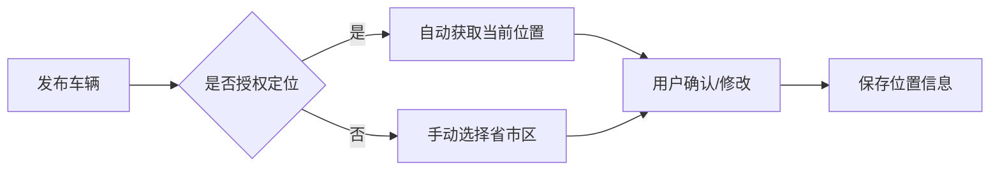
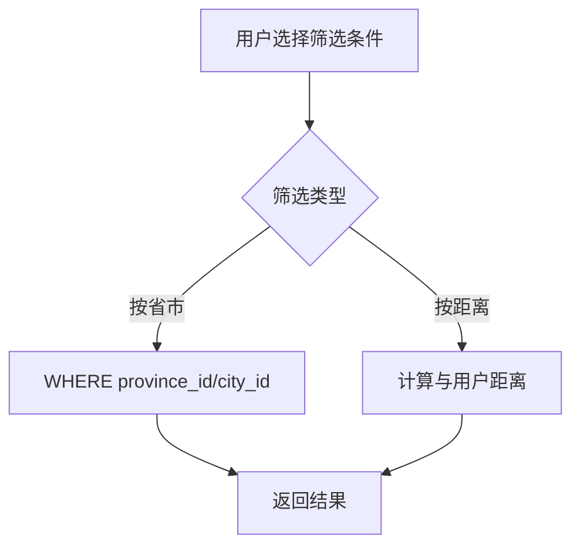

# 📋 需求规格说明书

## 功能名称
**车辆地理位置管理系统**

---

## 1. 功能概述

### 1.1 业务背景
二手车交易高度依赖地理位置：
- 买家倾向购买本地或附近城市的车辆（方便看车、过户）
- 车辆所在地影响运输成本和交易意愿
- 不同地区车辆保值率、车况差异明显

### 1.2 核心价值
- **买家侧**：快速筛选本地/附近车源，降低交易成本
- **车主侧**：精准触达目标区域买家
- **平台侧**：支持区域化运营，提升匹配效率

---

## 2. 功能需求

### 2.1 车辆位置信息

| 字段 | 必填 | 说明 |
|------|------|------|
| **省份** | ✅ | 一级行政区（省/直辖市/自治区） |
| **城市** | ✅ | 二级行政区（地级市） |
| **区县** | ⚪ | 三级行政区（区/县/县级市） |
| **详细地址** | ⚪ | 可选，精确到街道/小区 |

### 2.2 位置录入方式

| 方式 | 说明 | 优先级 |
|------|------|--------|
| **手动选择** | 省 → 市 → 区 三级联动下拉 | P0 |
| **自动定位** | 获取手机 GPS，自动填充 | P1 |
| **地图选点** | 在地图上点选位置 | P2 |

### 2.3 位置展示

**车辆卡片**：
```
┌─────────────────────────┐
│  [车辆图片]              │
│  2022 保时捷 911         │
│  📍 上海市 · 浦东新区     │  ← 显示城市+区县
│  💰 ¥1,280,000           │
└─────────────────────────┘
```

**车辆详情页**：
```
📍 车辆所在地
   上海市 浦东新区 陆家嘴
   [查看地图]  ← 可点击查看地图位置
```

### 2.4 位置筛选

| 筛选维度 | 说明 |
|----------|------|
| **按省份** | 选择一个或多个省份 |
| **按城市** | 选择一个或多个城市 |
| **按距离** | 距离我 50km / 100km / 200km 内 |
| **同城优先** | 默认优先展示同城车辆 |

**筛选 UI 示意**：
```
┌─────────────────────────────────┐
│  🔍 筛选                         │
├─────────────────────────────────┤
│  📍 位置                         │
│  ┌─────────┐ ┌─────────┐        │
│  │ 全国 ▼  │ │ 全部城市 ▼│       │
│  └─────────┘ └─────────┘        │
│                                 │
│  ○ 不限  ● 50km内  ○ 100km内    │
└─────────────────────────────────┘
```

---

## 3. 用户故事

### Story 1: 车主发布时填写位置
```
作为【车主】
我希望【发布车辆时能准确填写车辆所在地】
以便【让附近的买家能找到我的车】
```

### Story 2: 买家按位置筛选
```
作为【买家】
我希望【能按省市筛选车辆】
以便【只看本地或附近城市的车源】
```

### Story 3: 买家查看车辆位置
```
作为【买家】
我希望【在详情页看到车辆具体位置】
以便【评估看车和交易的便利性】
```

---

## 4. 数据模型设计

### 4.1 行政区划表 `regions`

| 字段 | 类型 | 说明 |
|------|------|------|
| `id` | Integer | 主键（行政区划代码） |
| `name` | String | 名称 |
| `parent_id` | Integer | 父级 ID |
| `level` | Integer | 层级（1=省, 2=市, 3=区县） |
| `pinyin` | String | 拼音（用于搜索） |
| `lat` | Decimal | 纬度（中心点） |
| `lng` | Decimal | 经度（中心点） |

### 4.2 车辆位置字段（扩展 `cars` 表）

| 字段 | 类型 | 说明 |
|------|------|------|
| `province_id` | Integer | 省份 ID |
| `city_id` | Integer | 城市 ID |
| `district_id` | Integer | 区县 ID（可空） |
| `address` | String | 详细地址（可空） |
| `lat` | Decimal | 纬度 |
| `lng` | Decimal | 经度 |

### 4.3 索引设计

```sql
-- 支持按省市筛选
CREATE INDEX idx_cars_province ON cars(province_id);
CREATE INDEX idx_cars_city ON cars(city_id);

-- 支持地理位置查询（需要空间索引）
CREATE SPATIAL INDEX idx_cars_location ON cars(location);
```

---

## 5. 业务流程

### 5.1 发布时填写位置



### 5.2 按位置筛选



---

## 6. 验收标准

### AC1: 位置录入
- [ ] 发布车辆时必须选择省份和城市
- [ ] 省市区三级联动正常工作
- [ ] 支持获取手机定位自动填充

### AC2: 位置展示
- [ ] 车辆卡片显示「城市 · 区县」
- [ ] 详情页显示完整地址
- [ ] 可点击查看地图位置

### AC3: 位置筛选
- [ ] 支持按省份筛选
- [ ] 支持按城市筛选
- [ ] 支持按距离筛选（需用户授权定位）

### AC4: 数据准确性
- [ ] 使用国家标准行政区划代码
- [ ] 行政区划数据定期更新

---

## 7. 技术实现建议

| 模块 | 方案 |
|------|------|
| **行政区划数据** | 国家统计局数据 / 高德/腾讯地图 API |
| **三级联动** | 前端缓存 + 懒加载 |
| **地图展示** | 高德地图 / 腾讯地图 JS SDK |
| **距离计算** | PostGIS / MySQL 空间函数 / Redis GEO |
| **定位获取** | H5 Geolocation API / 微信 JSSDK |

### 7.1 距离计算 SQL 示例

```sql
-- 计算距离并筛选 50km 内的车辆
SELECT *, 
  ST_Distance_Sphere(
    POINT(lng, lat), 
    POINT(121.4737, 31.2304)  -- 用户位置
  ) / 1000 AS distance_km
FROM cars
HAVING distance_km <= 50
ORDER BY distance_km;
```

---

## 8. 优先级

| 阶段 | 功能 | 优先级 |
|------|------|--------|
| **P0** | 省市区三级联动选择 | 必须 |
| **P0** | 车辆卡片/详情页展示位置 | 必须 |
| **P0** | 按省市筛选 | 必须 |
| **P1** | 自动定位填充 | 高 |
| **P1** | 按距离筛选 | 高 |
| **P2** | 地图选点 | 中 |
| **P2** | 地图查看位置 | 中 |

---

## 9. 行政区划数据来源

| 来源 | 说明 |
|------|------|
| **国家统计局** | 官方标准，免费，但更新慢 |
| **高德地图 API** | 实时准确，有调用限制 |
| **开源数据** | GitHub 上有维护的行政区划 JSON |

推荐：使用开源数据作为基础，定期同步更新。

---

## 文档信息

| 项目 | 内容 |
|------|------|
| **创建日期** | 2025-12-05 |
| **版本** | v1.0 |
| **状态** | 草稿 |
