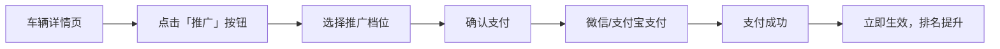
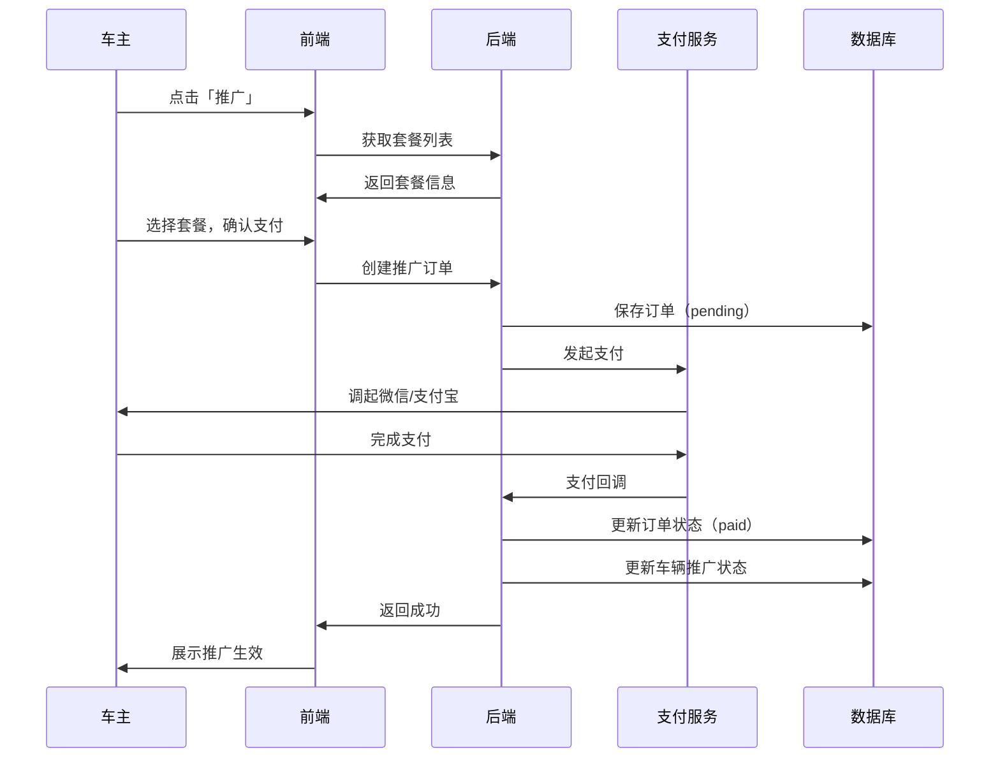
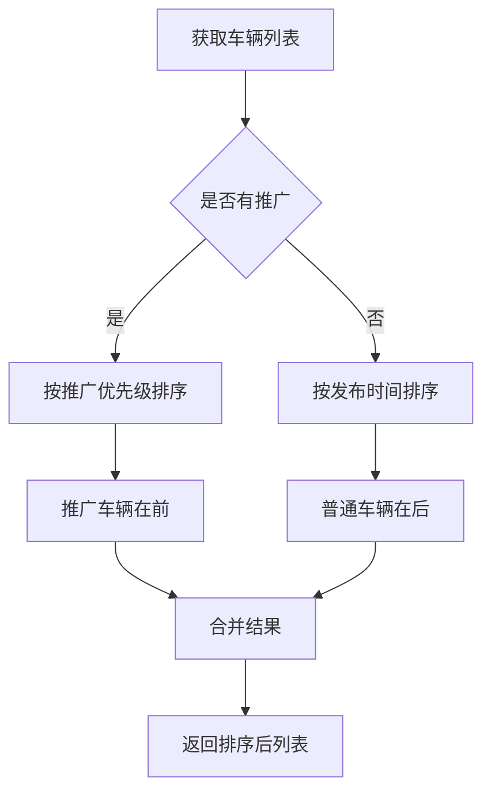

# 📋 需求规格说明书

## 功能名称
**车辆推广加速 - 付费曝光提升系统**

---

## 1. 功能概述

### 1.1 业务背景
车主发布车辆后，希望获得更多曝光以加速成交。平台提供付费推广服务，让车主可以通过小额付费将车辆展示到更靠前的位置。

### 1.2 核心价值
- **车主侧**：花小钱获得更多曝光，加速成交
- **平台侧**：核心变现渠道，可持续商业模式
- **买家侧**：优先看到活跃卖家的车辆（付费=诚意）

---

## 2. 产品设计

### 2.1 推广档位设计

| 档位 | 价格 | 效果 | 有效期 | 适用场景 |
|------|------|------|--------|----------|
| ⚡ **闪电推** | ¥5 | 首页置顶 2 小时 | 2 小时 | 急售、试水 |
| 🔥 **热门推** | ¥15 | 首页置顶 12 小时 | 12 小时 | 周末冲量 |
| 🚀 **火箭推** | ¥30 | 首页置顶 24 小时 | 24 小时 | 持续曝光 |
| 👑 **王者推** | ¥88 | 首页置顶 3 天 + 标签 | 72 小时 | 高价值车辆 |

### 2.2 展示效果

```
┌─────────────────────────────────────────┐
│  🔥 推广车辆                             │
├─────────────────────────────────────────┤
│  ┌─────────┐  ┌─────────┐  ┌─────────┐ │
│  │ 👑 王者  │  │ 🚀 火箭  │  │ ⚡ 闪电  │ │
│  │ 保时捷   │  │ 奔驰 S   │  │ 宝马 5   │ │
│  │ ¥128万   │  │ ¥68万    │  │ ¥35万    │ │
│  └─────────┘  └─────────┘  └─────────┘ │
├─────────────────────────────────────────┤
│  📋 最新发布                             │
├─────────────────────────────────────────┤
│  ┌─────────┐  ┌─────────┐  ┌─────────┐ │
│  │ 普通车辆 │  │ 普通车辆 │  │ 普通车辆 │ │
│  └─────────┘  └─────────┘  └─────────┘ │
└─────────────────────────────────────────┘
```

### 2.3 推广标识

| 档位 | 标识样式 | 位置 |
|------|----------|------|
| 闪电推 | ⚡ 小闪电角标 | 图片右上角 |
| 热门推 | 🔥 火焰边框 | 卡片边框 |
| 火箭推 | 🚀 动态光效 | 卡片背景 |
| 王者推 | 👑 皇冠 + 金色边框 | 全套豪华样式 |

---

## 3. 用户故事

### Story 1: 车主购买推广
```
作为【车主】
我希望【花 5 块钱让我的车展示在首页前列】
以便【获得更多曝光，更快卖出去】
```

### Story 2: 买家浏览推广车辆
```
作为【买家】
我希望【能区分推广车辆和普通车辆】
以便【知道哪些是付费推广的】
```

### Story 3: 车主查看推广效果
```
作为【车主】
我希望【看到推广期间的曝光数据】
以便【评估推广效果，决定是否续费】
```

---

## 4. 功能需求

### 4.1 购买流程



### 4.2 排序规则

| 优先级 | 规则 | 说明 |
|--------|------|------|
| 1 | 推广档位 | 王者 > 火箭 > 热门 > 闪电 |
| 2 | 推广剩余时间 | 剩余时间多的优先 |
| 3 | 同档位内 | 按购买时间倒序 |
| 4 | 非推广车辆 | 按发布时间倒序 |

### 4.3 推广管理

| 功能 | 说明 |
|------|------|
| **查看状态** | 当前推广档位、剩余时间 |
| **续费** | 推广到期前可续费延长 |
| **升级** | 可从低档位升级到高档位（补差价） |
| **数据统计** | 推广期间的曝光量、点击量、咨询量 |

### 4.4 推广效果数据

| 指标 | 说明 |
|------|------|
| **曝光量** | 车辆卡片被展示的次数 |
| **点击量** | 进入详情页的次数 |
| **点击率** | 点击量 / 曝光量 |
| **咨询量** | 收到的咨询消息数 |
| **收藏量** | 被收藏的次数 |

---

## 5. 数据模型设计

### 5.1 推广套餐表 `promotion_packages`

| 字段 | 类型 | 说明 |
|------|------|------|
| `id` | UUID | 主键 |
| `name` | String | 套餐名称（闪电推/热门推/...） |
| `price` | Decimal | 价格（分） |
| `duration_hours` | Integer | 有效时长（小时） |
| `priority` | Integer | 排序优先级 |
| `badge_type` | String | 标识类型 |
| `is_active` | Boolean | 是否上架 |

### 5.2 推广订单表 `promotion_orders`

| 字段 | 类型 | 说明 |
|------|------|------|
| `id` | UUID | 主键 |
| `car_id` | UUID | 推广的车辆 |
| `user_id` | UUID | 购买用户 |
| `package_id` | UUID | 套餐 ID |
| `amount` | Decimal | 支付金额（分） |
| `status` | Enum | 状态（pending/paid/expired/refunded） |
| `start_at` | Timestamp | 生效时间 |
| `end_at` | Timestamp | 到期时间 |
| `created_at` | Timestamp | 创建时间 |
| `paid_at` | Timestamp | 支付时间 |

### 5.3 推广效果表 `promotion_stats`

| 字段 | 类型 | 说明 |
|------|------|------|
| `id` | UUID | 主键 |
| `order_id` | UUID | 推广订单 ID |
| `car_id` | UUID | 车辆 ID |
| `date` | Date | 统计日期 |
| `impressions` | Integer | 曝光量 |
| `clicks` | Integer | 点击量 |
| `inquiries` | Integer | 咨询量 |
| `favorites` | Integer | 收藏量 |

---

## 6. 业务流程

### 6.1 购买推广



### 6.2 首页排序逻辑



---

## 7. 验收标准

### AC1: 购买流程
- [ ] 车辆详情页展示「推广」入口
- [ ] 可查看所有推广套餐及价格
- [ ] 支持微信/支付宝支付
- [ ] 支付成功后立即生效

### AC2: 展示效果
- [ ] 推广车辆展示在首页顶部
- [ ] 不同档位有不同的视觉标识
- [ ] 推广到期后自动恢复普通排序

### AC3: 数据统计
- [ ] 车主可查看推广期间的数据
- [ ] 数据实时更新（延迟 < 5 分钟）

### AC4: 边界情况
- [ ] 同一车辆重复购买时，时长叠加
- [ ] 升级套餐时，自动计算差价
- [ ] 车辆下架/删除时，推广自动失效（不退款）

---

## 8. 商业模型

### 8.1 定价策略

| 策略 | 说明 |
|------|------|
| **低门槛** | 5 元起步，降低尝试成本 |
| **阶梯定价** | 时长越长，单价越低 |
| **心理定价** | 88 元而非 90 元 |

### 8.2 收入预估

| 假设 | 数值 |
|------|------|
| 日活车辆数 | 1,000 |
| 付费转化率 | 5% |
| 客单价 | ¥20 |
| **日收入** | **¥1,000** |
| **月收入** | **¥30,000** |

### 8.3 运营玩法

| 玩法 | 说明 |
|------|------|
| **新人首推** | 首次推广 1 元体验 |
| **限时折扣** | 周末推广 8 折 |
| **充值优惠** | 充 100 送 20 |
| **推广券** | 邀请好友送推广券 |

---

## 9. 技术实现建议

| 模块 | 方案 |
|------|------|
| **支付** | 微信支付 + 支付宝（聚合支付） |
| **排序** | Redis Sorted Set 实时排序 |
| **定时任务** | 推广到期自动下线 |
| **数据统计** | 异步埋点 + 定时聚合 |

---

## 10. 优先级

| 阶段 | 功能 | 优先级 |
|------|------|--------|
| **P0** | 推广套餐配置 | 必须 |
| **P0** | 购买支付流程 | 必须 |
| **P0** | 首页排序逻辑 | 必须 |
| **P1** | 推广标识展示 | 高 |
| **P1** | 效果数据统计 | 高 |
| **P2** | 续费/升级 | 中 |
| **P2** | 运营活动支持 | 中 |

---

## 文档信息

| 项目 | 内容 |
|------|------|
| **创建日期** | 2025-12-05 |
| **版本** | v1.0 |
| **状态** | 草稿 |
